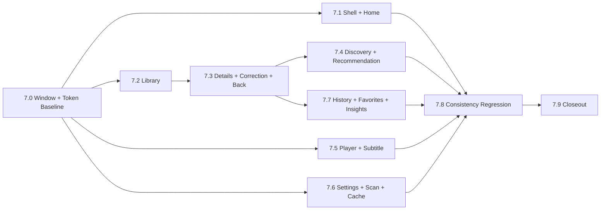

# Phase 6 UI 覆盖矩阵与 Phase 7 拆分计划

## 1. 文档用途

本文件是 Phase 6 的收口产物，用于回答三个问题：

1. 当前成品 UI 的页面、弹窗、菜单、状态和组件是否已经被新版 `DesignDraft` 覆盖。
2. 用户在 Phase 6 中确认的最终口径是否仍存在冲突或遗漏。
3. Phase 7 应按什么顺序实施 UI 重构，并如何验收而不改变业务语义。

本文件只定义设计覆盖关系、实现差距和实施顺序，不表示当前 XAML 已符合目标设计。

审计基线：

- 阶段：`Phase 6.1`
- 日期：`2026-05-27`
- 审计对象：当前 `src/MediaLibrary.App` UI 入口、导航、状态承载和相关服务接口
- 设计对象：`DesignDraft` 总规则与全部 `page-spec`
- 不纳入本阶段：XAML、ViewModel、code-behind、样式资源、业务逻辑、migration 和数据库修改

---

## 2. 判定口径

### 2.1 覆盖状态

| 状态 | 含义 |
|---|---|
| 已覆盖 | 当前组件或其 Phase 7 目标形态已有明确规格、状态和边界说明 |
| 部分覆盖 | 已有归属文档，但仍需补页面级审计或用户确认后才能实施 |
| 未覆盖 | 当前存在的可见组件没有规格承载 |
| Deferred | 已记录为实现差距、边界条件或后续能力，不阻塞当前设计文档收口 |

### 2.2 事实与目标的关系

- 当前代码入口用于证明组件真实存在，不作为保留旧视觉或旧交互的理由。
- 用户确认的 DesignDraft 规则是 Phase 7 的目标规格。
- 当前存在而目标设计需替换的组件仍视为已覆盖，但在实施备注中标为 Phase 7 差距。
- 隐藏兼容路由、fallback 状态和内部布局控件不因没有独立页面规格而构成遗漏，只要其可见结果有承载文档。

---

## 3. Phase 6 阶段完成矩阵

| Phase | 范围 | A 审计 | B 文档更新 | 用户确认 | 文档状态 | 未决项 | 主要 Deferred |
|---|---|---:|---:|---:|---|---|---|
| 6.0a / 6.0a-Replan | 总规划与 A/B 审计流程 | 完成 | 不适用 | 完成口径调整 | 流程已落实于后续批次 | 无 | Phase 7 才改 UI |
| 6.0b-A/B | 壳层、首页、账号、个人资料、全局确认 | 完成 | 完成 | 16 项已确认 | `global-shell.md`、`global-dialogs.md`、`home-page.md`、`user-profile-dialog.md` | 无 | 新壳层、统计与资料编辑实施 |
| 6.0c-A/B | 媒体库、批量、隐藏项、特殊项 | 完成 | 完成 | C01-C10 已确认 | `media-library-page.md`、`media-library-special-items.md` | 无 | 布局切换、提交搜索、特殊项呈现 |
| 6.0d-A/B | Movie / TV / Season / Episode 详情、修正 | 完成 | 完成 | D01-D13 已确认 | `movie-detail-page.md`、`tv-detail-page.md`、`episode-detail-page.md`、`correction-flow.md` | 无 | 弹窗式统一修正及详情状态落地 |
| 6.0e-A/B | 影片发现与 AI 推荐 | 完成 | 完成 | E01-E15 已确认 | `movie-discovery-page.md`、`recommendation-page.md` | 无 | Movie / TV 卡片、AI Tab 与布局切换 |
| 6.0f-A/B | 播放器、菜单、在线字幕 | 完成 | 完成 | F01-F14 已确认 | `player-page.md`、`online-subtitle-search-page.md` | 无 | 深色窗口、菜单结构和字幕状态实施 |
| 6.0g-A/B | 设置、扫描、缓存管理 | 完成 | 完成 | G01-G16 已确认 | `settings-page.md`、`scan-task-page.md`、`cache-management-page.md` | 无 | 表单安全控件、缓存卡、扫描状态 |
| 6.0h-A/B | 历史、收藏、洞察 | 完成 | 完成 | H01-H15 已确认 | `watch-history-page.md`、`favorites-page.md`、`watch-insights-page.md` | 无 | 导航定位、统计与图表实现 |
| 6.0i | 四类详情统一返回按钮 | 完成 | 完成 | 用户直接确认 | `global-shell.md`、详情三份规格、全局规则 | 无 | 来源返回栈能力 |

结论：Phase 6 页面组的既有用户决策均已进入现有 page-spec。Phase 6.1 重新扫描代码时新增发现 `P61-01`：播放器当前可见的本地视频缓存状态与最终播放器 / 缓存设计口径存在冲突；该项需用户确认后再进入播放器实施，不要求重做其它页面组审计。

---

## 4. 当前成品 UI 覆盖矩阵

### 4.1 页面、窗口与组件组

| 页面 / 组件组 | 当前代码入口 / 事实载体 | 对应 DesignDraft 文档 | 覆盖状态 | Phase 7 实施 | 备注 |
|---|---|---|---|---:|---|
| 全局壳层 | `Views/MainWindow.xaml`; `ViewModels/Main/MainWindowViewModel.cs` | `page-spec/global-shell.md`; `DESIGN.md` | 已覆盖 | 是 | XFVerse 品牌、导航、账号菜单、自定义窗口基线均已定义 |
| 首页 | `Views/Pages/HomePage.xaml`; `ViewModels/Pages/HomeViewModel.cs` | `page-spec/home-page.md` | 已覆盖 | 是 | 全部统计、相比上个月、无播放源详情和 AI 两态卡已定义 |
| 账号入口 / 用户菜单 | `MainWindow.xaml`; `MainWindowViewModel.cs` | `page-spec/global-shell.md`; `page-spec/home-page.md` | 已覆盖 | 是 | 设置、扫描、资料、主题、假退出入口按目标规格呈现 |
| 个人资料弹窗 | `Views/Dialogs/UserProfileDialogWindow.xaml` | `page-spec/user-profile-dialog.md` | 已覆盖 | 是 | 最终为本地资料编辑，不接复杂账号系统 |
| 全局确认弹窗 | `Views/Dialogs/ConfirmationDialogWindow.xaml`; `Services/Implementations/ConfirmationDialogService.cs` | `page-spec/global-dialogs.md` | 已覆盖 | 是 | 普通、警示、危险和局部 Popover 语义均定义 |
| 媒体库 | `Views/Pages/LibraryPage.xaml`; `ViewModels/Pages/LibraryViewModel.cs` | `page-spec/media-library-page.md` | 已覆盖 | 是 | 筛选、摘要、布局、提交搜索与来源状态均定义 |
| 特殊媒体项 | `LibraryViewModel.cs`; `LibraryMovieItemViewModel.cs`; Core library read/query models | `page-spec/media-library-special-items.md`; `page-spec/tv-detail-page.md` | 已覆盖 | 是 | Unknown、Other、orphan、failed、grouped 的详情承载已定义 |
| 批量操作 | `LibraryPage.xaml`; `LibraryViewModel.cs`; aggregation row view models | `page-spec/media-library-page.md`; `page-spec/media-library-special-items.md`; `page-spec/global-dialogs.md` | 已覆盖 | 是 | 普通 Series / 批量 Season 粒度和人工聚合边界已定义 |
| 已移出媒体库 | `LibraryPage.xaml`; `RemovedLibraryGroupViewModel.cs` | `page-spec/media-library-page.md`; `page-spec/global-dialogs.md` | 已覆盖 | 是 | 恢复、删除记录及 hide-only 语义已定义 |
| MovieDetailPage | `Views/Pages/MovieDetailPage.xaml`; `ViewModels/Pages/MovieDetailViewModel.cs` | `page-spec/movie-detail-page.md`; `page-spec/correction-flow.md` | 已覆盖 | 是 | 无源、无默认源、来源操作与统一返回目标已定义 |
| SeriesOverviewPage | `Views/Pages/SeriesOverviewPage.xaml`; `ViewModels/Pages/SeriesOverviewViewModel.cs` | `page-spec/tv-detail-page.md` | 已覆盖 | 是 | 剧详情、季列表、metadata-only 与返回目标已定义 |
| TvSeasonDetailPage | `Views/Pages/TvSeasonDetailPage.xaml`; `ViewModels/Pages/TvSeasonDetailViewModel.cs` | `page-spec/tv-detail-page.md` | 已覆盖 | 是 | 已识别 / 未识别季共用结构，当前文字返回待统一 |
| EpisodeDetailPage | `Views/Pages/EpisodeDetailPage.xaml`; `ViewModels/Pages/EpisodeDetailViewModel.cs` | `page-spec/episode-detail-page.md` | 已覆盖 | 是 | 单集、播放源、修正和返回目标已定义 |
| 统一修正流程 | 详情页当前修正状态及命令；相关 correction ViewModel rows | `page-spec/correction-flow.md`; `page-spec/global-dialogs.md` | 已覆盖 | 是 | 目标为弹窗式修正，当前页内承载属于实施差距 |
| 详情统一返回按钮 | 四类详情视图；`Services/Implementations/NavigationStateService.cs` | `page-spec/global-shell.md`; 三份详情规格；`codex-ui-rules.md` | 已覆盖 | 是 | 目标已定义；当前缺少通用来源栈，见 Deferred |
| 影片发现 | `Views/Pages/MovieDiscoveryPage.xaml`; `ViewModels/Pages/MovieDiscoveryViewModel.cs` | `page-spec/movie-discovery-page.md` | 已覆盖 | 是 | Movie / TV 共页、搜索、榜单及详情边界已定义 |
| AI 推荐 | `Views/Pages/RecommendationsPage.xaml`; `ViewModels/Pages/RecommendationsViewModel.cs`; Discovery AI 区域 | `page-spec/recommendation-page.md`; `page-spec/movie-discovery-page.md`; `page-spec/global-shell.md` | 已覆盖 | 是 | 可见目标为 Discovery 内 Tab；旧隐藏路由仅兼容 |
| 播放器 | `Views/Player/PlayerWindow.xaml(.cs)`; `ViewModels/Player/PlayerWindowViewModel.cs`; `PlaybackHostView.cs` | `page-spec/player-page.md`; `DESIGN.md` | 部分覆盖 | 是 | 深色窗口、控制栏、播放源、音轨与浮层已定义；当前可见本地视频缓存状态需按 `P61-01` 决策 |
| 在线字幕搜索 | `Views/Player/OnlineSubtitleSearchWindow.xaml`; `ViewModels/Player/OnlineSubtitleSearchViewModel.cs` | `page-spec/online-subtitle-search-page.md`; `page-spec/player-page.md` | 已覆盖 | 是 | 搜索、下载、绑定展示、错误和暂停边界已定义 |
| 设置页 | `Views/Pages/SettingsPage.xaml`; `ViewModels/Pages/SettingsViewModel.cs` | `page-spec/settings-page.md` | 已覆盖 | 是 | API、主题、行为设置与敏感字段规则已定义 |
| 缓存管理 | 设置页缓存区；`Services/SoftwareCacheManagementService.cs`; cache models | `page-spec/cache-management-page.md`; `page-spec/settings-page.md`; `page-spec/global-dialogs.md` | 已覆盖 | 是 | 当前不是单独页面；三类缓存与字幕保护规则已定义 |
| 扫描任务 | `Views/Pages/ScanTasksPage.xaml`; `ViewModels/Pages/ScanTasksViewModel.cs` | `page-spec/scan-task-page.md`; `page-spec/global-dialogs.md` | 已覆盖 | 是 | WebDAV / 本地双分区、共享日志及安全展示已定义 |
| 观影历史 | `Views/Pages/WatchHistoryPage.xaml`; `ViewModels/Pages/WatchHistoryViewModel.cs` | `page-spec/watch-history-page.md` | 已覆盖 | 是 | Movie / Episode、日期筛选和日历定位语义已定义 |
| 收藏夹 | `Views/Pages/FavoritesPage.xaml`; `ViewModels/Pages/FavoritesViewModel.cs` | `page-spec/favorites-page.md` | 已覆盖 | 是 | Movie / Season 粒度及取消状态已定义 |
| 观影洞察 | `Views/Pages/WatchInsightsPage.xaml`; `ViewModels/Pages/WatchInsightsViewModel.cs` | `page-spec/watch-insights-page.md`; `DESIGN.md` | 已覆盖 | 是 | 四项统计、图表、日历、画像状态和 Movie-only 边界已定义 |
| 长字段 / 敏感字段 / token 基线 | `Resources/Styles/*.xaml`; 各设置、播放器、扫描视图 | `codex-ui-rules.md`; `DESIGN.md`; 各 page-spec | 已覆盖 | 是 | Phase 7.0 先落全局基线 |

### 4.2 菜单、Popup、Overlay 与状态载体

| 当前载体 | 代码证据 | 设计承载 | 覆盖状态 | 处理结论 |
|---|---|---|---|---|
| 账号 Popup | `MainWindow.xaml` 中 `Popup` | `global-shell.md` | 已覆盖 | Phase 7 按旧设计菜单重构 |
| 媒体库筛选菜单 | `LibraryPage.xaml` 中播放源、来源、标签、收藏状态 `MenuItem` | `media-library-page.md` | 已覆盖 | 移除可见识别状态与库内 / 库外口径 |
| Discovery 榜单菜单 | `MovieDiscoveryPage.xaml` 中榜单和趋势 `MenuItem` | `movie-discovery-page.md` | 已覆盖 | 仅热门 / 高分 / 趋势及今日 / 本周 |
| 播放源 ContextMenu | `PlayerWindow.xaml.cs` 动态构建 source menu | `player-page.md` | 已覆盖 | 目标为表头式菜单行，安全路径显示 |
| 播放源菜单的本地视频缓存状态行 | `PlayerWindow.xaml.cs` 的 `CreateVideoCacheStatusItem`; `PlayerWindowViewModel.cs` 的 `IVideoCacheService` 使用 | 当前 `player-page.md` 排除离线缓存进度 | 部分覆盖 | 进入 `P61-01` 用户决策，不在本阶段替用户删除或补设计 |
| 字幕 ContextMenu | `PlayerWindow.xaml.cs` 动态构建 subtitle menu | `player-page.md`; `online-subtitle-search-page.md` | 已覆盖 | 四类字幕、绑定删除 Popover 和搜索入口 |
| 音轨 ContextMenu | `PlayerWindow.xaml.cs` 动态构建 audio menu | `player-page.md` | 已覆盖 | 当前选中、空、加载、失败均纳入目标 |
| 播放器控制 / 提示 Overlay | `PlayerWindow.xaml` 的 `ControlBarPopup`、`BufferingOverlayPopup`、`OperationNoticePopup`、`InteractionFeedbackPopup` | `player-page.md` | 已覆盖 | opening 至 notice 的状态矩阵承载 |
| 删除字幕绑定轻量确认 | 当前播放器操作入口 | `global-dialogs.md`; `player-page.md` | 已覆盖 | 只删除绑定，不删除缓存 |
| 删除本地扫描路径轻量确认 | 扫描页路径操作 | `global-dialogs.md`; `scan-task-page.md` | 已覆盖 | 只移除配置，不删除文件 |
| 清理 / 删除 / 移出确认 | `ConfirmationDialogService.cs`; 页面相关命令 | `global-dialogs.md` | 已覆盖 | 安全语义统一 |
| loading / empty / error / disabled | 各页面 `StatusMessage`、busy、visibility、can-execute 状态 | 各 page-spec；`codex-ui-rules.md` | 已覆盖 | Phase 7 建立共用状态组件 |
| config missing / auth failed / rate limited | 设置、Discovery、在线字幕状态 | 相应 page-spec | 已覆盖 | 状态 UI，不擅自扩展业务 |
| no source / metadata-only / unknown | 媒体库与详情链路 | 媒体库和详情 page-spec | 已覆盖 | 仍可进入详情，保留安全语义 |
| cache protected / scan running / partial failure | 缓存和扫描服务 / ViewModel | 缓存和扫描 page-spec | 已覆盖 | 按真实能力显示，不伪造结果 |

---

## 5. 文档冲突检查结果

### 5.1 已确认规则检查表

| 检查项 | 结果 | 规格证据 / 处理结论 |
|---|---|---|
| 首页是否残留“本月统计”为最终片库预览口径 | 通过 | `home-page.md` 已明确全部统计；`DESIGN.md` 禁止继续用本月统计作为最终口径 |
| 首页 / 洞察趋势是否仍使用“较上周” | 通过 | `home-page.md`、`watch-insights-page.md` 均明确相比上个月 |
| 媒体库是否仍提供“库内 / 库外影片”范围筛选 | 通过 | `media-library-page.md` 明确不纳入新版设计，以播放源状态替代 |
| 媒体库是否将 grouped placeholder 写成无详情 | 通过 | `media-library-special-items.md`、`tv-detail-page.md` 明确已有详情承载 |
| 详情页是否仍纳入字幕入口 | 通过 | Movie、TV、Episode 详情规格均明确字幕归播放器 |
| 在线字幕是否排除未识别播放项绑定显示 | 通过 | `online-subtitle-search-page.md` 已定义绑定到当前播放文件的 UI 语义 |
| 播放源路径是否被写成完全禁止显示 | 通过 | `codex-ui-rules.md` 与 `player-page.md` 允许文件路径、屏蔽完整 WebDAV URL、长字段省略 |
| 敏感字段是否仍按明文常显设计 | 通过 | `settings-page.md` 与 `codex-ui-rules.md` 使用眼睛图标显示 / 隐藏 |
| 扫描页是否仍保留暂停按钮为目标能力 | 通过 | `scan-task-page.md` 与 `DESIGN.md` 明确不保留暂停 |
| 扫描识别计数是否固定显示长期 `--` | 通过 | `scan-task-page.md` 将识别计数限定为稳定产出后的完成摘要 |
| 收藏夹是否不提供取消动作或限制库外喜爱取消 | 通过 | `favorites-page.md` 明确保留取消动作，库外 / 无源项亦可取消 |
| 洞察是否仍保留“未看”统计卡 | 通过 | `watch-insights-page.md` 与 `DESIGN.md` 为四项统计，不含未看卡 |
| TV 是否被写入 Movie 推荐 / 洞察 / 画像 | 通过 | `recommendation-page.md`、`watch-insights-page.md` 与 `DESIGN.md` 统一 Movie-only 边界 |
| 主窗口 / 播放器是否仍接受原生标题栏为最终设计 | 通过 | `global-shell.md`、`player-page.md` 与 `DESIGN.md` 均定义自定义窗口按钮 |
| 详情页是否仍缺统一返回目标规格 | 通过 | `global-shell.md` 与 Movie / TV / Episode 详情规格已有统一图标返回规则 |
| 隐藏 Recommendations 路由是否仍被写成新版可见入口 | 通过 | `global-shell.md`、`movie-discovery-page.md`、`recommendation-page.md` 均定义为内部兼容 |
| 删除 / 移出 / 清理是否存在删除真实文件的错误语义 | 通过 | `global-dialogs.md`、媒体库与缓存规格均明确不删除真实本地 / WebDAV 文件 |
| 当前播放器本地视频缓存状态是否与“无离线缓存最终 UI”一致 | 发现冲突，待决策 | 当前 `PlayerWindow.xaml.cs` 显示 `本地缓存` 状态且 `PlayerWindowViewModel.cs` 使用 `IVideoCacheService`；`player-page.md` 与缓存规格不将离线视频缓存纳入最终 UI |

### 5.2 本阶段修正结论

- 未发现适合在无用户确认情况下直接修改既有 page-spec 的小范围口径冲突。
- 新发现 `P61-01` 属于当前可见组件与既定设计边界冲突，不能由本阶段擅自选择删除或保留，因此只在本矩阵登记并等待确认。
- 新增本覆盖矩阵，用于将 Phase 6 决策落实状态、当前 UI 入口映射和 Phase 7 实施差距集中固化。
- `UI-REBUILD-README.md` 增加本文件入口，避免 Phase 7 仅按单页规格实施而遗漏跨页边界。

---

## 6. 未覆盖组件与 Deferred 清单

### 6.1 页面级结论

当前扫描到的可见 `Page`、`Window`、Dialog 和 Popup 均已找到设计承载。播放器播放源菜单中的本地视频缓存状态属于已发现但需要产品决策的组件冲突，不是可以自动归入最终设计的既有规格。

| 项目 | 判定 | 建议 |
|---|---|---|
| `P61-01` 播放器本地视频缓存状态菜单项与实际缓存服务 | 当前有、最终规格排除离线缓存 UI；需用户决策 | 用户确认保留并补规格、移除最终入口、改为仅缓冲状态，或另开缓存能力阶段；确认前不实施播放器目标 UI |
| `RecommendationsPage` 隐藏路由 | Deferred，不是可见页面遗漏 | 保留兼容记录；Phase 7 不加入主导航 |
| `PlaybackHostView` | 播放器内部承载，已由 `player-page.md` 覆盖 | 不新增独立 page-spec |
| `VirtualizingWrapPanel` | 媒体库布局实现细节，已由大列表 / 布局状态覆盖 | Phase 7 实现时验证性能与 render-ready 状态 |
| 当前详情页内修正面板 | 目标设计已由 `correction-flow.md` 覆盖 | Phase 7 迁移到统一弹窗，不视为设计缺口 |
| 当前状态消息的逐字文案 | 状态类别已覆盖，具体 copy 可能随实现调整 | Phase 7 按中文文案与安全规则复核 |

### 6.2 需要在 Phase 7 实施而非继续补规格的差距

| 差距 | 状态 | Phase 7 去向 |
|---|---|---|
| 播放器存在 `本地缓存` 状态菜单及 `VideoCacheService`，与不展示离线缓存的目标规格存在冲突 | Blocker（仅阻塞播放器 / 视频缓存相关实施） | 用户确认 `P61-01` 后再进入 7.5 的相关组件实施 |
| 统一详情返回依赖真实来源状态，但当前导航服务无完整返回栈 | Deferred | Phase 7.3 先定义最小来源快照 / fallback 实现方案 |
| 主窗口与播放器自定义标题栏 | Deferred | Phase 7.0 |
| 全局 token、状态组件、Popover / Menu / Dialog 基线 | Deferred | Phase 7.0 |
| 媒体库真实布局切换与选择记忆 | Deferred | Phase 7.2 |
| 媒体库提交式搜索与目标筛选结构 | Deferred | Phase 7.2 |
| Discovery 的真实布局切换和 Movie / TV 卡片一致化 | Deferred | Phase 7.4 |
| 播放器深色弹窗、菜单和在线字幕搜索视觉统一 | Deferred | Phase 7.5 |
| 设置页行为项中尚未具备的命令 | Deferred，功能能力待确认 | Phase 7.6 只实现已有能力；缺失功能另开确认 |
| 扫描识别计数是否可稳定产出 | Deferred，需代码 / 数据验证 | Phase 7.6 仅在证实后显示 |
| 日历跳历史并恢复定位状态 | Deferred | Phase 7.7 |

### 6.3 Noise

- `screenshots/播放器/01-播放器-弹窗^%全屏.pn` 文件扩展名为 `.pn`，但文件头为 PNG；不影响 Markdown 规格收口，后续整理资源时可重命名。

---

## 7. Phase 7 UI 重构拆分计划

### 7.1 分阶段计划

| Phase | 范围 | 不做 | 关键验收 | 主要风险 | 涉及业务逻辑 | Build | 手工验收 |
|---|---|---|---|---|---|---:|---:|
| 7.0 | 全局窗口、token、按钮、表单、Menu / Popup / Popover / Dialog、状态组件、长字段、图表 / 日历基线 | 不改页面业务流程，不新增后端命令 | 主窗口与播放器自定义窗口按钮；浅 / 深主题；播放器深色变体；敏感字段与长字段规则可复用 | 窗口拖拽、缩放、焦点和主题资源回归 | 通常否；窗口行为需最小 UI 事件处理 | 是 | 是 |
| 7.1 | 壳层、首页、账号菜单、个人资料、全局确认 | 不修改统计计算或账号后端 | XFVerse 品牌；首页全部统计与上月趋势文案；资料本地编辑形态；确认等级一致 | 当前首页数据口径与目标展示不一致 | 统计 / 保存能力若缺失需另报 | 是 | 是 |
| 7.2 | 媒体库、批量操作、特殊媒体项、已移出面板 | 不改 hide/delete 语义，不调整识别服务 | 提交搜索；来源筛选；布局切换记忆；Series / Season 粒度；所有特殊项可进详情 | 大列表性能、批量失败反馈、安全语义回归 | 仅已有命令接线；新缺口另报 | 是 | 是 |
| 7.3 | Movie / Series / Season / Episode 详情、统一返回、统一修正弹窗 | 不新增字幕、删除、移出入口 | 四详情统一返回；无源 / metadata-only；弹窗修正；播放源警示确认 | 返回来源栈当前不足；修正流程复杂 | 可能需最小导航状态支持，须先明确范围 | 是 | 是 |
| 7.4 | Discovery 搜索、榜单、AI 推荐 Tab、偏好弹窗 | 不给 TV 接入 AI 推荐或画像 | Movie / TV 共页；人物仅 Movie；榜单口径；AI Movie-only；布局切换 | 当前隐藏路由和入口状态兼容 | 不改推荐算法 | 是 | 是 |
| 7.5 | 播放器、播放源 / 字幕 / 音轨菜单、在线字幕搜索 | 不做字幕编辑、OCR、真实文件删除；未确认前不处理视频缓存入口去留 | 固定深色；四类字幕；删除绑定 Popover；错误 / 额度；打开暂停关闭不恢复；落实 `P61-01` 结论 | mpv 状态、窗口层级、菜单定位、视频缓存现状冲突 | 复用当前会话逻辑；`P61-01` 需先确认 | 是 | 是 |
| 7.6 | 设置、缓存管理、扫描任务 | 不新增视频缓存、暂停扫描、真实文件删除 | 眼睛按钮；保存 / 测试分离；三类缓存；保护数量；双扫描分区和安全日志 | 凭据安全、扫描统计能力不确定 | 行为设置缺失能力须单独确认 | 是 | 是 |
| 7.7 | 历史、收藏、洞察、日历定位 | 不将 TV 纳入 Movie 洞察或画像 | Movie / Episode 历史；Movie / Season 收藏；取消动作；洞察四卡；日历定位 | 导航状态恢复、统计口径和图表空态 | 不改统计业务边界 | 是 | 是 |
| 7.8 | 全局状态与视觉一致性回归 | 不引入新页面或新流程 | loading / empty / error / disabled / config missing / no source 全页一致；菜单、弹窗、字段规则一致 | 局部硬编码或旧样式遗漏 | 否 | 是 | 是 |
| 7.9 | Phase 7 全量 UI 回归与收口 | 不夹带发布 / 安装策略 | 全量人工矩阵通过；文档与实现差距关闭或 Deferred；无语义回归 | 跨链路导航和危险操作回归 | 只修确认后的 UI 缺陷 | 是 | 是 |

### 7.2 建议优先级与依赖

- `7.0` 是所有视觉实施的硬前置，避免各页面重新定义控件 token。
- `7.2` 先于 `7.3`，因为媒体库特殊项是详情入口矩阵的主要来源。
- `7.3` 先于 `7.7`，因为历史和收藏需要稳定详情导航及返回行为。
- `7.5` 与页面链路可在 `7.0` 完成后独立推进，但字幕边界不能反向扩展到详情页。

### 7.3 Phase 7 人工验收矩阵

| 编号 | 场景 | 通过条件 |
|---|---|---|
| V01 | 主窗口和播放器窗口 | 不使用原生标题栏作为最终视觉；自定义窗口按钮可访问、可操作 |
| V02 | 首页统计与入口 | 片库预览为全部统计，无未看卡；趋势为相比上个月；发现更多进入 AI 推荐语义 |
| V03 | 媒体库筛选与布局 | 搜索仅提交后执行；来源状态筛选正确；海报 / 列表切换并记忆 |
| V04 | 媒体库危险操作 | 移出只隐藏并保留状态；删除记录不删除真实文件；文案准确 |
| V05 | 特殊项详情 | Unknown / Other / grouped placeholder / unknown season 均可进入对应详情链路 |
| V06 | 详情导航与修正 | 四详情具有统一返回；能恢复来源或执行明确 fallback；修正以弹窗呈现 |
| V07 | Discovery 与 AI | Movie / TV 搜索和榜单正常；AI 只使用 Movie；隐藏推荐路由不成为导航项 |
| V08 | 播放器字幕链路 | 四类字幕菜单；搜索弹窗深色；打开时暂停且关闭不自动恢复；删除绑定不删缓存；本地视频缓存入口按 `P61-01` 确认结果呈现 |
| V09 | 设置与缓存 | 凭据眼睛按钮；保存不触发测试；字幕缓存只清孤立项；错误状态清楚 |
| V10 | 扫描任务 | WebDAV / 本地分区；不显示暂停；日志脱敏；删除路径不删除文件 |
| V11 | 历史、收藏、洞察 | 历史跨 Movie / Episode；收藏跨 Movie / Season 且可取消；洞察 Movie-only 四项统计 |
| V12 | 状态与主题回归 | loading、empty、error、disabled、config missing、no source 在浅 / 深主题下可读且一致 |

---

## 8. Phase 7 风险清单

| 风险 | 影响 | 处理要求 |
|---|---|---|
| 导航来源 / 返回栈能力不足 | 统一返回按钮无法恢复列表、筛选或 Tab 状态 | 在 7.3 前定义最小来源状态方案；未确认前不随意改导航语义 |
| 首页当前统计实现与最新口径不一致 | UI 可能显示错误范围或文案 | 7.1 先验证数据来源；需要业务变更时单独报告 |
| 媒体库与 Discovery 布局切换仍为占位或未记忆 | 设计目标不能只靠样式实现 | 分别在 7.2 / 7.4 验证视图模式和偏好持久化 |
| 媒体库当前搜索交互与提交式目标不同 | 筛选体验及性能可能改变 | 7.2 明确命令触发时机并回归空 / loading / error 状态 |
| 旧设计行为设置当前可能未实现 | 容易伪装为可用开关 | 7.6 仅呈现已具备能力，缺失能力列为单独功能决策 |
| 扫描识别计数不能稳定产出 | 长期显示错误或 `--` 指标 | 7.6 先验证数据能力，不满足则不显示 |
| 播放器标题栏、Popup 和深色弹窗改造 | 全屏、焦点、菜单定位、mpv 画面可能回归 | 7.0 / 7.5 进行窗口和播放交互手工回归 |
| 敏感字段显示切换与存储边界 | 凭据可能被明文暴露 | 7.0 / 7.6 将显示规则与受保护存储规则分开验证 |
| 在线字幕 API 状态与字段漂移 | 错误提示、额度、下载态不准确 | 7.5 按现有客户端结果枚举映射，不编造额度能力 |
| 当前已存在视频缓存服务和播放器状态行，但最终规格排除离线缓存 UI | 未确认就实施可能误删能力或造成错误展示 | 先确认 `P61-01`：保留、移除入口、重设语义或另开阶段 |
| Movie-only 推荐 / 洞察边界回退 | TV 数据误入画像或推荐 | 7.4 / 7.7 使用边界验收数据验证 |
| 移出 / 删除记录 / 缓存清理文案回退 | 用户误解为删除真实文件 | 每一危险操作都引用全局确认规格并人工验收 |
| TV / Other / Unknown / grouped 详情入口回退 | Phase 4 能力被 UI 改造破坏 | 7.2 / 7.3 必须覆盖所有类型的入口回归 |

---

## 9. Phase 6 收口与 Phase 7 入口判断

### 9.1 收口判定

- Phase 6 所列页面组、弹窗、菜单、Overlay、关键状态和安全边界均已有 DesignDraft 承载。
- 本轮冲突检查未发现需要追加整页 A/B 审计的缺口。
- 新发现 `P61-01` 是针对播放器本地视频缓存状态的单项决策点，需要在实施播放器组件前确认。
- 除 `P61-01` 外，剩余问题属于 Phase 7 实施、实现能力核对或验收阶段需要处理的 Deferred。

### 9.2 建议

建议进入 `Phase 7.0`，先实施不依赖视频缓存去留决策的全局窗口、token 与控件基线。进入 `Phase 7.5` 播放器组件实施前，必须先确认 `P61-01`：

- 是否保留当前播放器 `本地缓存` 状态能力并补入最终菜单设计。
- 是否从最终可见 UI 移除该入口，但不在纯 UI 阶段擅自删除后端能力。
- 是否将其另开为独立的视频缓存产品阶段，不与 mpv buffering 语义混写。

进入实施时仍应遵守：

- 不用 UI 重构改变媒体删除、隐藏、缓存、字幕和扫描安全语义。
- 涉及业务能力补足的差距，例如导航来源栈、未实现行为设置或扫描统计能力，先单列方案并确认，不夹带到纯视觉补丁中。
- 每个 Phase 7 子阶段都运行 build，并进行相应人工验收矩阵。

### 9.3 Phase 6 明确未做

- 未修改 XAML、ViewModel、code-behind 或样式资源。
- 未修改核心业务语义或新增 UI 功能。
- 未新增 migration，未执行 database update。
- 未实施 Phase 7 UI 重构。
