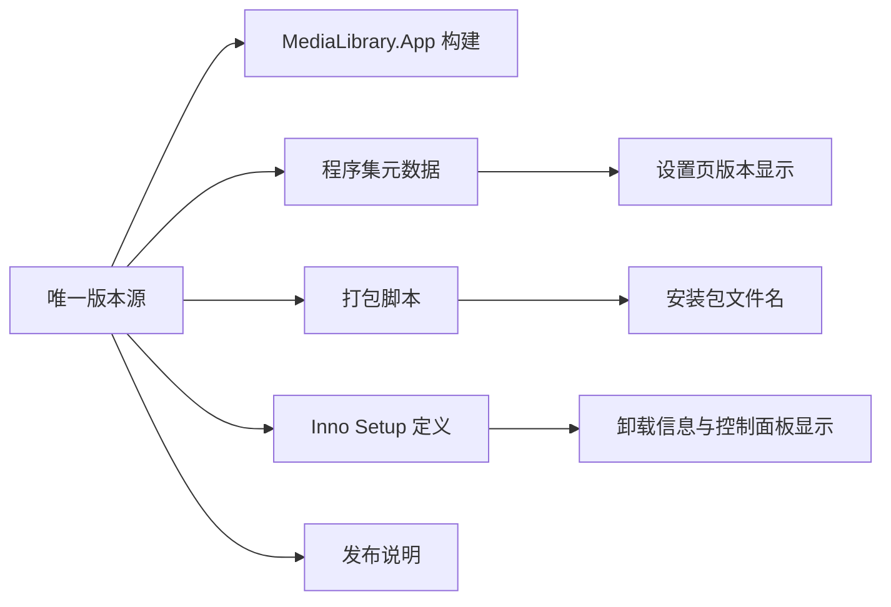
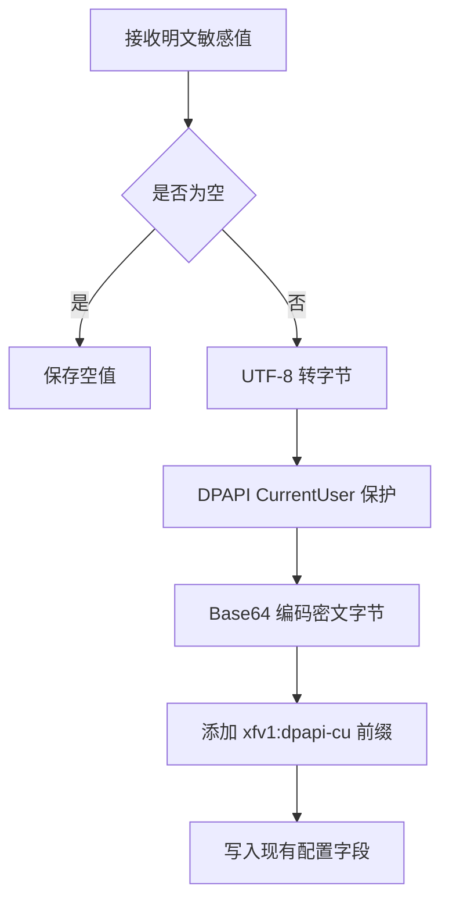
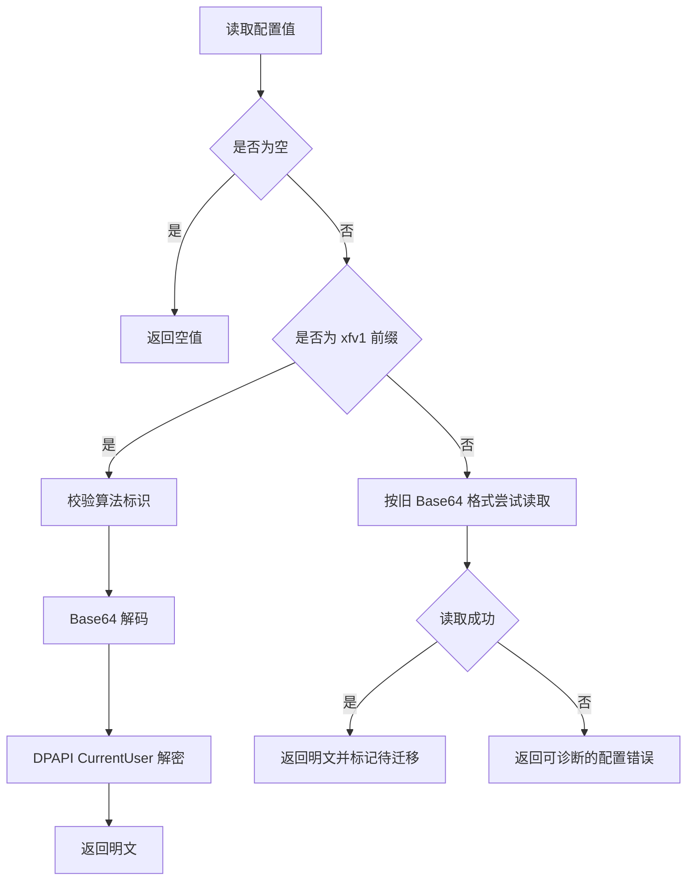
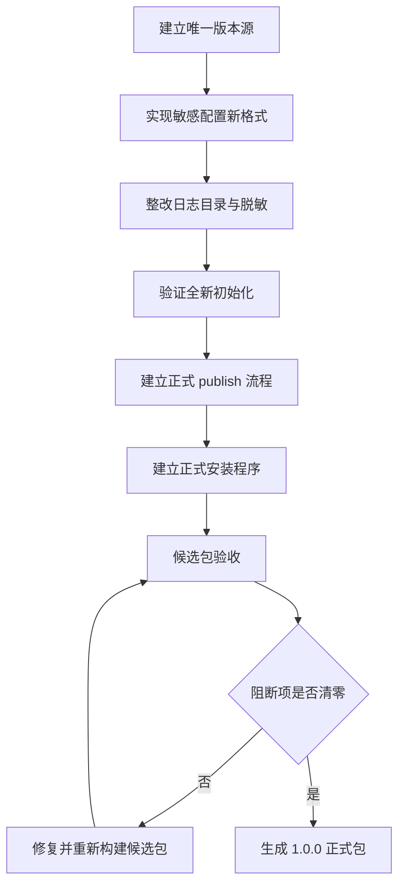

# XFVerse 1.0 发布加固设计

## 1. 文档信息

| 项目 | 内容 |
| --- | --- |
| 文档名称 | XFVerse 1.0 发布加固设计 |
| 所属阶段 | Phase 8.3 发布加固 |
| 文档性质 | 设计、审计与实施约束 |
| 当前状态 | 设计及 8.3 核心代码实施完成；正式安装生命周期待 Phase 8.4 验证 |
| 适用版本 | XFVerse 1.0 |
| 目标平台 | Windows |
| 技术基础 | .NET 8、C#、WPF、EF Core、SQLite |

本文档定义 XFVerse 1.0 在正式打包前需要完成的版本治理、敏感配置保护、数据生命周期、日志隐私、全新初始化和发布验证设计。

本阶段先完成设计，随后按“不改变业务逻辑、界面和功能结果”的边界实施发布加固：

- 当前代码与发布资源的审计结论。
- 可直接实施的设计方案。
- 实际代码实施的文件影响面。
- 验收条件、风险和回滚要求。

版本、凭据、日志和扫描历史隐私保护已经写入代码并通过构建及专项验证；正式安装包尚未生成，因此本文档不代表软件已经满足 GA 发布条件。

## 2. 目标与非目标

### 2.1 目标

发布加固需要形成以下闭环：

1. 建立唯一、可追踪的软件版本来源。
2. 统一程序集、界面、安装程序、包名和发布说明中的版本。
3. 使用 Windows 当前用户范围的数据保护能力保存敏感配置。
4. 兼容读取现有 Base64 格式配置，并在安全时机迁移。
5. 明确安装、首次启动、升级、修复、卸载和完整清理的数据语义。
6. 将运行日志放入用户数据目录，并对路径、URL、账号和密钥脱敏。
7. 保证正式包不携带开发者数据库、缓存、日志或私人配置。
8. 为 Phase 8.4 正式打包提供明确的输入条件和阻断项。

### 2.2 非目标

本设计不包含以下内容：

- 不新增或调整业务功能。
- 不改变媒体库删除、隐藏和用户状态语义。
- 不修改数据库结构。
- 不新增 EF Core migration。
- 不执行 database update。
- 不生成正式安装包。
- 不修改业务逻辑、XAML、页面布局、导航、识别规则或播放器行为。
- 允许修改版本属性、安全存储、诊断日志和发布脚本。
- 不对课程设计报告负责。

## 3. 当前实现审计摘要

### 3.1 审计结论

| 编号 | 审计项 | 当前证据 | 结论 |
| --- | --- | --- | --- |
| H01 | 应用版本来源 | 根目录 `Directory.Build.props` 定义 Version、AssemblyVersion、FileVersion 和 InformationalVersion | 已建立唯一版本源 |
| H02 | 设置页版本 | 设置页从程序集版本读取，Release 产物为 `1.0.0` | 已消费统一来源 |
| H03 | 测试包版本 | 测试打包脚本默认读取统一版本属性，仍允许显式覆盖 | 日期默认版本已移除 |
| H04 | 安装程序身份 | 现有测试安装定义使用固定测试 AppId | 正式版必须使用独立且稳定的 AppId |
| H05 | 测试数据 | 测试打包流程存在携带种子或用户数据的能力 | 正式包必须明确排除 |
| H06 | 敏感配置 | 新值使用 DPAPI CurrentUser 和 `xfv1:dpapi-cu:` 格式，旧 Base64 可读取 | 8.3 已实施 |
| H07 | 配置字段 | WebDAV、字幕服务等密码或令牌通过现有设置字段保存 | 字段可复用，通常不需数据库 migration |
| H08 | 应用数据目录 | 默认使用当前用户 LocalAppData 下的应用目录 | 方向正确，应形成统一目录契约 |
| H09 | 诊断日志 | 诊断日志统一写入用户数据 Logs 目录，并通过公共组件脱敏 | 8.3 已实施 |
| H10 | 扫描任务快照 | 新快照使用 DPAPI 透明保护，旧明文快照保持兼容读取 | 8.3 已实施且不改变界面结果 |
| H11 | 全新初始化 | 现有测试包流程不能证明无私人数据启动 | 正式包验收尚未完成 |
| H12 | migration | 本阶段无数据库结构需求 | migration 应保持为空 |

### 3.2 发布阻断判断

以下项目在进入正式打包前必须实现并验证：

- 统一版本源。
- 正式安装程序身份与测试安装程序身份隔离。
- 正式包排除用户数据和种子数据。
- 敏感配置从 Base64 升级为 Windows 数据保护。
- 日志目录和隐私字段整改。
- 全新用户环境的首次启动验证。

本次实施已解除版本源、敏感字段保护和日志隐私的代码阻断。测试包数据、正式安装器身份、第三方许可和正式安装生命周期仍由 Phase 8.4 收口。

## 4. 统一版本设计

### 4.1 设计原则

版本信息必须满足：

- 单一来源：版本只在一个受版本控制的文件中定义。
- 多处消费：项目构建、界面、安装程序、包名和发布说明读取同一来源。
- 可追踪：候选版能关联构建或提交信息。
- 可比较：Windows 文件版本保持四段数字格式。
- 可发布：正式版显示为 `1.0.0`，不使用日期代替产品版本。
- 可维护：后续补丁版本只修改一个版本入口。

### 4.2 推荐的唯一版本源

推荐在仓库根目录建立版本属性文件，并由解决方案中的项目自动导入。可以选择：

- 根目录 `Directory.Build.props`。
- 或根目录 `eng/Version.props`，再由 `Directory.Build.props` 导入。

对于当前项目规模，推荐直接使用根目录 `Directory.Build.props`，减少额外层级。

建议属性模型：

| 属性 | 正式版示例 | 候选版示例 | 用途 |
| --- | --- | --- | --- |
| VersionPrefix | `1.0.0` | `1.0.0` | 产品基础版本 |
| VersionSuffix | 空 | `rc.1` | 预发布标识 |
| Version | `1.0.0` | `1.0.0-rc.1` | NuGet/MSBuild 语义版本 |
| AssemblyVersion | `1.0.0.0` | `1.0.0.0` | 程序集绑定版本 |
| FileVersion | `1.0.0.0` | `1.0.0.0` | Windows 文件版本 |
| InformationalVersion | `1.0.0` | `1.0.0-rc.1+提交标识` | UI 和诊断显示 |

### 4.3 版本消费关系



各消费端规则如下：

| 消费端 | 规则 |
| --- | --- |
| WPF 应用 | 由 MSBuild 自动写入程序集元数据 |
| 设置页 | 优先显示 InformationalVersion，无法读取时回退 Version |
| 打包脚本 | 从版本属性文件读取，不允许默认使用当天日期 |
| Inno Setup | 通过命令行参数接收版本，不在脚本中另写常量 |
| 安装包文件名 | `XFVerse-Setup-1.0.0.exe` |
| 候选包文件名 | `XFVerse-Setup-1.0.0-rc.1.exe` |
| 发布说明 | 标题、资产名和应用内版本一致 |

### 4.4 正式版与候选版策略

候选阶段建议按以下顺序：

1. `1.0.0-rc.1`
2. 修复候选验收发现的问题。
3. 必要时发布 `1.0.0-rc.2`。
4. 所有正式发布阻断项清零后生成 `1.0.0`。

正式版不得继续使用：

- 日期字符串作为产品版本。
- 脚本参数、项目文件和安装定义各自维护版本。
- UI 写死版本文本。
- 同一安装包内出现不一致版本。

### 4.5 版本验证

实施后必须自动或人工核对：

1. 可执行文件属性中的产品版本。
2. 可执行文件属性中的文件版本。
3. 设置页显示版本。
4. 安装向导显示版本。
5. Windows 已安装应用列表显示版本。
6. 安装包文件名。
7. 发布说明标题。
8. 候选版和正式版的升级比较结果。

八处值必须来自同一版本源，并符合各自格式要求。

## 5. 敏感配置保护设计

### 5.1 保护范围

当前需要纳入保护的配置至少包括：

- WebDAV 密码。
- 字幕服务密码。
- 字幕服务访问令牌。
- 后续新增的 API 密钥、刷新令牌或同等敏感值。

普通设置项，如主题、语言、排序、扫描开关和非敏感显示名称，不应加密，以免增加不必要的故障面。

### 5.2 安全边界

XFVerse 是 Windows 单用户桌面应用，推荐使用 Windows DPAPI CurrentUser 范围：

- 数据只能由同一 Windows 用户上下文解密。
- 密文复制到其他 Windows 用户后不能直接解密。
- 密文复制到其他计算机后通常不能直接解密。
- 应用不保存自定义主密码。
- 应用不在日志中输出明文或密文全文。

该方案用于保护静态配置，不用于替代远端服务自身的传输加密。

### 5.3 密文格式

建议使用带版本和算法标识的字符串格式：

```text
xfv1:dpapi-cu:<Base64CipherText>
```

字段含义：

| 片段 | 含义 |
| --- | --- |
| `xfv1` | XFVerse 敏感值格式版本 1 |
| `dpapi-cu` | Windows DPAPI CurrentUser |
| 最后一段 | DPAPI 输出字节的 Base64 表示 |

格式必须可扩展。未来算法变化时新增前缀，不复用旧前缀改变含义。

### 5.4 写入流程



写入要求：

- 新保存的非空敏感值一律使用新格式。
- 不允许新增 Base64-only 写入分支。
- 内存中的明文只在调用远端服务所需的最短范围内存在。
- 异常信息不得包含明文、完整密文或远端请求头。
- 数据库字段能容纳新字符串时不新增 migration。

### 5.5 读取与兼容流程



兼容规则：

- 空值保持空值。
- 带新前缀的值只按新格式处理，不降级尝试旧格式。
- 无前缀值按旧 Base64 格式兼容读取。
- 旧值读取成功后，在用户下一次保存设置时写回新格式。
- 不建议仅因应用启动就批量重写全部配置。
- 解密失败不能静默返回空字符串，否则会把“配置损坏”伪装成“未配置”。
- UI 应提示用户重新输入对应凭据，但不得展示原值。

### 5.6 可选附加熵

如果实现使用 DPAPI 的 optional entropy，必须满足：

- 熵值是产品级固定字节，不是硬编码密码。
- 熵值不能依赖安装路径、机器名或用户名。
- 同一格式版本内保持稳定。
- 修改熵值必须升级格式版本。

不使用附加熵也可以满足当前单用户桌面应用的基本保护目标，实施时应优先选择简单、可恢复的方案。

### 5.7 跨用户与跨机器行为

预期行为如下：

| 场景 | 预期结果 |
| --- | --- |
| 同一用户正常启动 | 可以解密 |
| 同一用户升级应用 | 可以解密 |
| 不同 Windows 用户读取同一数据库 | 无法解密，提示重新输入 |
| 将数据库复制到其他计算机 | 无法解密，提示重新输入 |
| 用户删除凭据 | 保存空值，不保留旧密文 |
| 旧版 Base64 配置首次读取 | 兼容使用，等待安全迁移 |
| 新格式损坏 | 明确报错，不回退为旧格式 |

### 5.8 敏感配置验收

实施后至少验证：

1. 数据库中不存在新保存的敏感明文。
2. 新保存值具有受控格式前缀。
3. 同一 Windows 用户可正常读取。
4. 旧 Base64 值仍可读取。
5. 旧值在用户保存后升级为新格式。
6. 错误密文不会导致应用崩溃。
7. 错误密文不会被当作空配置。
8. 日志不包含明文、完整密文或令牌。
9. 跨 Windows 用户不能直接解密。
10. migration diff 保持为空。

## 6. 应用数据生命周期设计

### 6.1 统一目录契约

正式版应以当前 Windows 用户的 LocalAppData 作为可写数据根目录。逻辑结构建议如下：

```text
%LOCALAPPDATA%\MediaLibrary\
├─ Data\
│  └─ 应用数据库
├─ Cache\
│  ├─ Images\
│  ├─ Metadata\
│  └─ Temporary\
├─ Logs\
├─ Backups\
└─ State\
```

目录名称可以结合现有实现调整，但必须保持以下边界：

- 安装目录只存放只读程序文件和随包资源。
- 数据库、缓存、日志和用户状态只能写入用户数据目录。
- 开发环境覆盖变量只能用于明确的开发、测试或隔离验收。
- 正式包不应依赖仓库目录、当前工作目录或解决方案文件存在。

### 6.2 生命周期矩阵

| 操作 | 程序文件 | 数据库 | 用户配置 | 缓存 | 日志 | 说明 |
| --- | --- | --- | --- | --- | --- | --- |
| 首次安装 | 新建 | 不预置私人数据库 | 不预置 | 不预置私人缓存 | 不预置 | 安装结束后由应用首次启动初始化 |
| 首次启动 | 保持 | 创建空白数据库或执行内置初始化 | 创建默认值 | 按需创建 | 按需创建 | 不出现开发者媒体记录 |
| 覆盖升级 | 替换 | 保留并兼容 | 保留 | 可保留 | 可保留 | 升级不得清空用户数据 |
| 修复安装 | 修复 | 保留 | 保留 | 保留 | 保留 | 只修复程序资源 |
| 普通卸载 | 删除 | 默认保留 | 默认保留 | 可提示清理 | 可提示清理 | 避免误删用户媒体库状态 |
| 完整清理 | 删除 | 经用户明确确认后删除 | 经确认后删除 | 删除 | 删除 | 必须是独立、明确且可撤销前提示的操作 |

### 6.3 首次启动

正式包首次启动必须满足：

1. 不依赖开发者机器上的数据库。
2. 不展示开发者媒体条目。
3. 不包含开发者扫描目录。
4. 不包含 WebDAV 地址、账号或密码。
5. 不包含 API 密钥、令牌或字幕服务凭据。
6. 不包含开发日志。
7. 空媒体库有明确的引导入口。
8. 缺少可选外部组件时给出可理解提示。
9. 初始化失败时保留可诊断日志，但日志必须脱敏。
10. 用户可以关闭并再次启动，初始化结果保持一致。

### 6.4 升级

升级设计必须保证：

- 使用稳定正式 AppId 识别同一产品。
- 新版本覆盖程序文件，不覆盖用户数据库。
- 新版本启动前或升级过程中不执行破坏性清理。
- 数据库结构确需变化时才新增 migration。
- migration 执行前建立可恢复备份。
- 升级失败不删除原数据库。
- 用户敏感配置使用兼容读取策略。
- 旧日志和缓存不应阻断启动。

当前 Phase 8.3 设计不要求数据库结构变化，因此不应产生 migration。

### 6.5 数据库备份与回滚

正式发布前应定义最小备份策略：

| 场景 | 建议动作 |
| --- | --- |
| 无数据库结构变化的普通升级 | 不强制备份，但建议保留最近一次健康副本 |
| 执行 migration 前 | 关闭数据库连接后复制数据库及相关 SQLite 文件 |
| migration 成功 | 保留有限数量的最近备份 |
| migration 失败 | 停止启动流程，保留原始文件和失败日志 |
| 用户手动恢复 | 提供文档步骤，不自动覆盖现有数据 |

备份文件名可以包含 UTC 时间和版本，但不得包含用户名、媒体名称或扫描路径。

### 6.6 缓存

缓存必须满足可删除、可重建和不承载唯一用户数据：

- 图片和元数据缓存删除后可以重新获取或重新生成。
- 临时文件在异常退出后可以被后续启动清理。
- 清理缓存不得删除媒体记录、用户状态或凭据。
- 卸载程序不得把“缓存”与“数据库”混为同一清理项。
- 缓存目录不应被打入安装包。
- 缓存失败不应导致数据库损坏。

## 7. 日志与隐私设计

### 7.1 日志目录

正式版运行日志应固定写入当前用户应用数据目录中的 Logs 子目录。

不允许将正式运行日志默认写入：

- 仓库根目录。
- 解决方案目录。
- 应用安装目录。
- 当前工作目录。
- 用户选择的媒体目录。

开发模式如需额外日志位置，应通过明确的开发开关启用，且不能进入正式发布配置。

### 7.2 日志分类

建议最小分类：

| 类别 | 内容 | 默认级别 |
| --- | --- | --- |
| App | 启动、退出、版本、未处理异常摘要 | Information |
| Database | 初始化、连接、迁移状态，不含查询参数敏感值 | Information |
| Scan | 扫描批次、计数、耗时、脱敏错误 | Information |
| Playback | 播放器加载、退出码、能力检测 | Information |
| Network | 服务类型、状态码、耗时，不含认证头和完整 URL | Warning |
| Diagnostics | 用户主动导出的诊断摘要 | 按需 |

日志级别应由正式配置限制。Debug 或 Trace 级别不能无限期默认开启。

### 7.3 禁止记录的信息

日志中不得出现：

- 密码。
- API key。
- access token、refresh token。
- Authorization、Cookie 等认证头。
- 完整 WebDAV URL。
- 完整本地绝对路径。
- Windows 用户名。
- 字幕服务账号。
- 数据库中的完整密文。
- 用户媒体文件名的大批量清单。

错误对象或第三方异常可能隐含上述内容，写日志前必须经过安全转换。

### 7.4 允许的诊断信息

为保证可诊断性，可以记录：

- 文件扩展名。
- 安全文件名样本，但数量必须受限。
- 路径类型，例如本地、UNC、WebDAV。
- 脱敏后的末级目录名。
- URL 的协议和主机哈希。
- 账号的掩码或稳定哈希。
- 记录数量、成功数量、失败数量和耗时。
- 异常类型和不含敏感值的摘要。
- 版本、运行时和操作系统大版本。

### 7.5 脱敏规则

建议建立统一脱敏组件，不允许每个调用点自行拼接。

| 数据类型 | 输入示意 | 日志输出 |
| --- | --- | --- |
| 本地路径 | 完整绝对路径 | `<local>/末级名称` 或稳定短哈希 |
| UNC 路径 | 服务器和共享完整路径 | `<unc>/<share-hash>` |
| WebDAV URL | 含协议、主机和路径 | `<webdav>/<host-hash>/<path-depth>` |
| 用户名 | 完整账号 | 首尾字符掩码或短哈希 |
| 文件名 | 真实媒体文件名 | 受限样本、扩展名或短哈希 |
| Token | 任意令牌 | `<redacted>` |
| 密文 | 完整配置值 | `<protected-value>` |

哈希用于关联同一对象时，应使用稳定算法并截断显示；不得使用可逆编码冒充脱敏。

### 7.6 扫描任务快照

现有扫描任务快照需要按“完成诊断所需的最小信息”重新定义：

- 服务地址只保留类型、主机哈希和路径层级。
- 用户名默认不持久化，确需关联时保存不可逆短哈希。
- 扫描路径只保留来源标识、末级显示名或短哈希。
- 不保存密码、令牌或认证头。
- 不把快照字段反向用作业务匹配规则。
- 历史记录展示使用安全显示值，不尝试还原原始隐私数据。

如果现有数据库字段只保存字符串，可在不改变结构的前提下写入脱敏值；是否需要迁移历史数据必须单独评估，不能为了清理历史内容直接破坏扫描记录。

### 7.7 原生组件诊断

播放器或原生库加载日志不得输出完整候选目录列表。

推荐记录：

- 组件名称。
- 加载阶段。
- 成功或失败。
- 错误码。
- 候选来源类型，例如“应用目录资源”或“系统搜索路径”。

不推荐记录：

- 应用完整安装路径。
- 当前工作目录完整路径。
- 用户目录。
- 每个候选 DLL 的完整绝对路径。

### 7.8 日志保留与清理

建议正式版采用大小和时间双限制：

- 单个日志文件达到上限后轮转。
- 默认保留 14 天。
- 总日志目录达到容量上限时删除最旧日志。
- 崩溃日志可以单独延长，但仍需容量限制。
- 用户可在设置或帮助入口打开日志目录。
- 用户可主动清理日志。
- 日志清理失败只提示，不阻断应用启动。

具体天数和容量应在实现阶段结合实际日志量验证，不应未经测试直接写死为不可调整常量。

### 7.9 诊断包导出

如后续提供“一键导出诊断包”，默认只包含：

- 应用版本和运行环境摘要。
- 最近的脱敏日志。
- 数据库结构版本，不包含数据库文件。
- 功能开关摘要，不包含凭据。
- 用户明确勾选的附加信息。

导出前应显示内容说明，生成后允许用户自行检查。诊断包不能默认上传到任何服务。

## 8. 正式包内容边界

### 8.1 必须包含

正式包应包含：

- 发布模式应用程序文件。
- 所需 .NET 运行时策略对应的文件。
- 必要的 mpv、ffmpeg 或其他本地运行资源。
- 应用图标和界面资源。
- 第三方许可与版权声明。
- 安装程序卸载支持。
- 与版本一致的发布元数据。

### 8.2 禁止包含

正式包不得包含：

- 开发者数据库。
- seed-data 或个人验证数据。
- 用户配置。
- 缓存。
- 日志。
- 私有媒体文件或文件名清单。
- API key、token、password。
- `.git`、IDE 缓存和构建中间目录。
- 测试安装程序的身份信息。
- 仓库内部阶段文档，除非明确选择随软件分发。

### 8.3 发布目录白名单

正式打包应以 `dotnet publish` 的干净输出为输入，并采用白名单增补方式：

1. 清理独立的发布暂存目录。
2. 执行 Release publish。
3. 校验 publish 输出。
4. 只复制明确列出的第三方资源和许可文件。
5. 扫描禁止文件、敏感扩展名和已知数据目录。
6. 计算文件清单和哈希。
7. 交给正式安装程序构建。

不得直接以仓库目录、开发输出目录或现有测试包目录为正式打包输入。

### 8.4 正式与测试安装身份

正式安装程序必须具备独立、稳定的产品身份：

| 项目 | 正式版要求 |
| --- | --- |
| AppId | 新建正式 AppId，并在 1.x 升级中保持稳定 |
| DisplayName | XFVerse |
| Publisher | 使用项目实际发布者名称 |
| InstallDir | 使用正式产品目录 |
| Uninstall Key | 不与测试版共用 |
| DataDir | 与安装目录分离 |
| Upgrade | 覆盖正式旧版本，不接管测试安装 |

测试版和正式版可以并存时，还要避免快捷方式、文件关联和协议注册冲突。

### 8.5 卸载设计

普通卸载默认只删除安装程序管理的程序文件。

如果提供“同时删除用户数据”选项，必须：

- 默认不勾选。
- 明确列出数据库、设置、缓存和日志将被删除。
- 提醒此操作不会删除用户原始本地媒体文件或 WebDAV 文件。
- 二次确认。
- 只删除已确认的 XFVerse 用户数据根目录。
- 对目标路径进行绝对路径和边界验证。

任何卸载逻辑都不得递归删除用户媒体目录。

## 9. 计划实施影响面

本节只记录后续实施位置，不授权在当前阶段修改这些文件。

### 9.1 版本治理

| 位置 | 计划变更 |
| --- | --- |
| 仓库根目录版本属性文件 | 建立唯一版本源 |
| App 项目 | 消费统一程序集和文件版本 |
| 设置页版本读取逻辑 | 优先显示 InformationalVersion |
| 发布脚本 | 从唯一版本源读取版本 |
| 正式 Inno Setup 定义 | 接收同一版本参数 |
| 发布说明模板 | 使用相同产品版本 |

### 9.2 敏感配置

| 位置 | 计划变更 |
| --- | --- |
| SecretProtector | 增加带版本前缀的 DPAPI CurrentUser 保护 |
| SettingsService | 区分新格式、旧格式和损坏格式 |
| WebDAV 配置保存 | 新保存值使用新格式 |
| 字幕服务配置保存 | 密码和令牌使用新格式 |
| 设置 UI | 解密失败时提示重新输入 |
| 日志调用点 | 禁止输出配置原值 |

### 9.3 日志和数据目录

| 位置 | 计划变更 |
| --- | --- |
| DiagnosticLogPathResolver | 正式版固定到用户数据 Logs 目录 |
| MpvNativeLoader | 移除完整绝对路径日志 |
| 扫描任务记录 | 对地址、用户名和路径快照脱敏 |
| 日志公共组件 | 增加统一脱敏帮助方法 |
| 应用启动 | 创建并验证数据目录 |
| 诊断文档 | 说明日志位置、导出和清理方法 |

### 9.4 打包

| 位置 | 计划变更 |
| --- | --- |
| 正式发布脚本 | 新建干净 publish 和暂存流程 |
| 正式安装定义 | 新建正式 AppId 和安全卸载规则 |
| 测试安装定义 | 保持测试身份，不作为正式输入 |
| 包内容校验 | 增加禁止文件和敏感内容扫描 |
| 第三方声明 | 汇总随包组件许可 |

## 10. 推荐实施顺序



顺序理由：

- 版本源必须先建立，后续产物才能稳定命名和比较。
- 敏感配置和日志整改必须在产生候选包前完成。
- 全新初始化验证通过后，才能证明 publish 输入不依赖私人数据。
- 正式安装程序应只消费已经通过内容检查的 publish 暂存目录。
- 每次修复候选问题都必须重新生成包，不能手工替换包内文件。

## 11. Phase 8.3 验收映射

### 11.1 验收矩阵

| 验收项 | 要求 | 当前结果 | 当前判定 |
| --- | --- | --- | --- |
| 8.3-A01 | 设置页、EXE、安装器输入和发布说明读取同一版本 | MSBuild、EXE、DLL 和测试安装器输入统一为 `1.0.0`；正式安装器和发布说明待后续阶段消费 | 核心通过，后续产物待验证 |
| 8.3-A02 | 新保存的敏感字段不再是可直接还原的 Base64 编码 | DPAPI CurrentUser 专项往返验证通过 | 通过 |
| 8.3-A03 | 旧 Base64 配置可读取并在重新保存后迁移 | 旧格式读取专项验证通过，现有保存入口统一写入新格式 | 通过 |
| 8.3-A04 | 无效或跨用户密文不导致应用整体启动失败 | 解密异常被隔离为对应配置空值，不影响应用整体启动；跨用户实机待 RC | 代码通过，实机待验证 |
| 8.3-A05 | 日志不输出完整 URL、路径、账号或秘密 | 日志路径统一，公共脱敏专项验证通过，mpv 完整路径输出已移除 | 通过 |
| 8.3-A06 | 空数据目录首次启动可创建数据库 | 未执行 database update 或全新启动；转 Phase 8.4 隔离环境验证 | 待 8.4 |
| 8.3-A07 | 旧数据库副本升级后核心数据保留 | 本阶段无 schema 变化；旧凭据和旧扫描快照兼容读取，完整升级待 8.4 | 核心兼容通过 |
| 8.3-A08 | 安装、升级、修复和卸载形成代码或安装器约束 | 生命周期规则已冻结，正式安装器约束待 8.4 实施 | 待 8.4 |
| 8.3-A09 | Release build 成功 | `dotnet build MediaLibrary.sln -c Release --no-restore` 成功，0 警告、0 错误 | 通过 |
| 8.3-A10 | migration diff 为空 | Git 范围检查确认 migration diff 为空 | 通过 |

### 11.2 文档验收

当前可以确认：

- 版本治理方案已经明确。
- 敏感配置格式、兼容和错误语义已经明确。
- 安装、升级、修复、卸载和完整清理边界已经明确。
- 日志位置、脱敏、保留和导出边界已经明确。
- 正式包包含与禁止内容已经明确。
- 后续实施影响面和顺序已经明确。

当前仍不能确认：

- 正式安装包是否安全。
- 全新 Windows 用户是否可启动。
- 安装、升级和卸载是否符合矩阵。

## 12. 实施验证清单

### 12.1 自动检查

Phase 8.4 和 RC 阶段应继续执行：

1. `dotnet build MediaLibrary.sln -c Release`。
2. 检查所有版本消费端输出。
3. 检查 migration diff 为空。
4. 扫描 publish 目录中的数据库、日志、缓存和配置文件。
5. 扫描安装包暂存目录中的敏感扩展名和已知目录。
6. 对发布文件生成 SHA-256 清单。
7. 检查安装定义使用正式 AppId。
8. 检查卸载脚本不存在越界递归删除。

### 12.2 人工检查

| 编号 | 场景 | 预期结果 |
| --- | --- | --- |
| M01 | 空白 Windows 用户首次安装 | 安装成功，无私人数据 |
| M02 | 首次启动 | 自动初始化，显示空状态引导 |
| M03 | 保存 WebDAV 密码 | 功能可用，数据库无明文 |
| M04 | 读取旧 Base64 配置 | 可正常使用并在保存后迁移 |
| M05 | 损坏新格式密文 | 明确提示重新输入，不崩溃 |
| M06 | 普通覆盖升级 | 数据库和用户状态保留 |
| M07 | 修复安装 | 只修复程序文件 |
| M08 | 普通卸载 | 用户数据默认保留 |
| M09 | 选择完整清理 | 只删除 XFVerse 数据，不删除媒体文件 |
| M10 | 检查日志 | 无完整路径、URL、账号、令牌和密码 |
| M11 | 检查版本 | UI、文件属性、安装列表和包名一致 |
| M12 | 测试版与正式版共存 | 安装身份和卸载项互不覆盖 |

## 13. 风险与控制

| 风险 | 影响 | 控制措施 |
| --- | --- | --- |
| DPAPI 导致跨用户不可解密 | 用户迁移机器后凭据失效 | 明确提示重新输入，不影响非敏感数据 |
| 旧 Base64 数据异常 | 设置读取失败 | 区分旧格式损坏与新格式损坏 |
| 版本多源残留 | 升级判断或显示不一致 | 构建前执行版本一致性检查 |
| 日志脱敏过度 | 难以定位问题 | 保留类型、计数、阶段、哈希和错误码 |
| 日志脱敏不足 | 泄露本地环境或账号 | 使用统一脱敏组件和禁止字段检查 |
| 卸载清理越界 | 删除用户数据或媒体 | 路径边界校验、默认不清数据、二次确认 |
| 测试包资源混入正式包 | 泄露私人数据 | 干净 publish、白名单复制和内容扫描 |
| 全新初始化未验证 | 用户安装后不能运行 | 在隔离用户或虚拟机执行首次启动验收 |

## 14. 回滚原则

后续实施发生问题时：

- 版本治理可以回滚到上一候选标签，但不得手工改包内版本。
- 凭据新格式不得自动降级写回 Base64。
- 新格式读取失败时保留原始密文，等待用户重新输入或恢复备份。
- 日志整改失败不能通过恢复完整敏感日志来规避。
- 安装程序问题必须重新构建候选包。
- 数据库异常优先恢复备份，不执行破坏性修复。
- 回滚程序版本不得删除用户数据库、缓存或设置。

## 15. 与后续阶段的关系

### 15.1 Phase 8.4 起始基线

进入正式打包阶段时：

- 统一版本源已经实现并验证。
- 敏感配置保护已经实现并验证。
- 日志目录和脱敏已经实现并验证。
- Phase 8.4 需要实现正式包的数据白名单策略。
- Phase 8.4 需要确定并实现正式安装身份。
- Phase 8.4 和 Phase 8.8 需要完成第三方许可清单。

### 15.2 当前可继续的工作

在 Phase 8.3 核心代码完成后，可以继续：

- 审计正式打包所需文件。
- 编写打包与发布操作文档。
- 编写安装说明、使用说明书、帮助文档和 README。
- 编写候选版验收表。
- 整理第三方组件及许可证据。

但不能据此宣称已经完成正式安装包或正式发布。

## 16. 阶段结论

Phase 8.3 的发布加固设计和核心代码已经完成，版本、凭据、日志和隐私保护已按设计落地。

本阶段已经完成：

- 唯一版本源落地及 Release 产物验证。
- DPAPI 敏感配置保护。
- 旧 Base64 配置兼容读取和保存时迁移。
- 日志路径、公共脱敏和 mpv 路径输出整改。
- 扫描历史快照透明保护与旧数据兼容读取。

以下工作仍未执行：

- 正式 publish 与安装程序构建。
- 全新安装、升级和卸载验证。

因此，Phase 8.3 可标记为“核心发布加固完成”，并进入 Phase 8.4 正式打包和安装生命周期实施。XFVerse 1.0 在 Phase 8.4～8.9 完成前仍不具备 GA 放行条件。
