# XFVerse 1.0 软件设计说明书

Last updated: 2026-06-20

## 1. 文档概述

### 1.1 文档目的

本文描述 XFVerse 1.0 当前实际采用的软件整体设计，包括产品边界、系统架构、模块职责、数据模型、关键流程、外部服务、安全与隐私、性能与可靠性、部署方式和 UI/UX 设计。

本文是技术设计文档，不是安装教程、用户操作手册、故障排查手册或课程设计报告。

### 1.2 目标读者

- XFVerse 的开发和维护人员。
- 负责发布、测试和技术评审的人员。
- 需要理解系统边界、数据语义和设计决策的后续参与者。

### 1.3 适用范围

- 产品版本：XFVerse 1.0.0。
- 应用类型：Windows 桌面应用。
- 正式目标平台：Windows 10 / Windows 11 x64。
- 技术基础：.NET 8、C#、WPF、EF Core 8、SQLite。
- 本文基于当前仓库代码、项目文件、数据库模型、阶段文档和现有 UI 设计资产。

### 1.4 非目标

- 不重新设计或修改实际 UI。
- 不描述尚未进入当前代码的设想功能。
- 不把 ARM64、X86、自动更新、Portable 或云账号写成 1.0 能力。
- 不提供真实本地路径、WebDAV URL、账号或凭据样本。
- 不替代安装说明、软件使用说明书和帮助文档。

### 1.5 事实来源

事实优先级如下：

1. 当前代码、项目文件、数据库模型和实际资源。
2. `XFVERSE_1_0_FEATURE_MATRIX.md`。
3. `XFVERSE_1_0_RELEASE_DECISIONS.md`。
4. 当前阶段文档和 Known Issues。
5. `DesignDraft` 页面规格与 UI 阶段记录。
6. 历史草图和旧测试包。

草图用于说明 UI 的设计意图和形成过程。草图与当前实现不一致时，以当前代码为准，并在 UI 追溯矩阵中标记“调整后落地”或“未采用”。

### 1.6 术语

| 术语 | 含义 |
| --- | --- |
| Movie | 电影实体。 |
| Series | 电视剧总实体。 |
| Season | 电视剧的一季。 |
| Episode | 电视剧的一集。 |
| MediaFile | 一个实际本地文件或 WebDAV 远端文件的软件来源记录。 |
| metadata-only | 有元数据实体但没有可播放来源。 |
| placeholder | 识别证据不足时保留的占位实体或待修正项目。 |
| 移出媒体库 | 只改变可见性，保留 metadata 和用户状态。 |
| 删除记录 | 删除软件记录，不删除真实媒体文件。 |
| RC | 发布候选版本。 |
| GA | 正式公开版本。 |

## 2. 产品与系统上下文

### 2.1 产品定位

XFVerse 是一个独立运行的 Windows 桌面媒体库应用，提供：

- 本地目录和 WebDAV 媒体扫描。
- Movie 与 TV 识别、分组、详情和人工修正。
- 本地与 WebDAV 播放。
- 多播放源、音轨、内嵌字幕、外挂字幕和在线字幕。
- 影片发现、榜单和 Movie AI 推荐。
- 用户状态、收藏夹、观影历史和 Movie-only 观影洞察。
- 海报、外部 metadata 和在线字幕缓存管理。

应用可以在仅使用本地媒体时工作。WebDAV、TMDB、OMDb、OpenSubtitles 和 AI 都不是基础启动条件。

### 2.2 系统边界

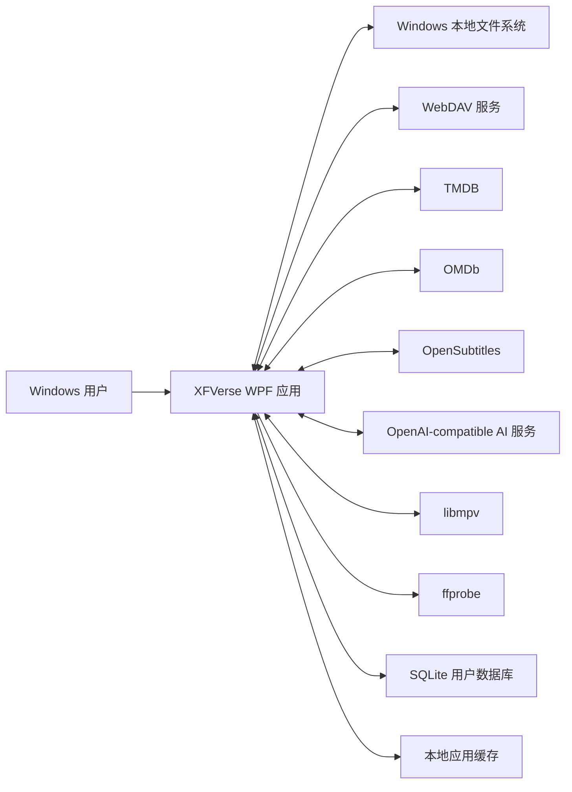

### 2.3 必需与可选依赖

| 依赖 | 作用 | 基础启动是否必需 | 失败时的设计行为 |
| --- | --- | --- | --- |
| Windows 桌面环境 | 运行 WPF 应用 | 是 | 无法在非 Windows 环境运行。 |
| SQLite | 保存软件数据 | 是 | 数据库初始化失败时阻止进入不确定状态。 |
| libmpv | 视频播放 | 仅播放必需 | 媒体浏览仍可用，播放显示明确错误。 |
| ffprobe | 媒体技术信息探测 | 否 | 保留原数据并允许重试。 |
| 本地文件系统 | 本地扫描、缓存和配置 | 是 | 目录不可写时给出启动或操作错误。 |
| WebDAV | 远端扫描与播放 | 否 | 本地功能继续可用。 |
| TMDB | 识别、发现和元数据 | 否 | 使用已有数据或进入待修正状态。 |
| OMDb | 外部评分补充 | 否 | 只缺少对应评分。 |
| OpenSubtitles | 在线字幕 | 否 | 已有字幕和播放继续可用。 |
| AI 服务 | 分类 hint、推荐和画像 | 否 | 使用规则、缓存或明确降级状态。 |

### 2.4 产品语义红线

- 不删除本地媒体文件。
- 不删除 WebDAV 文件。
- 删除扫描路径只删除软件配置。
- 移出媒体库只影响可见性。
- 移出媒体库不清除想看、喜爱、不想看或已看状态。
- 删除记录只清除定义范围内的软件记录。
- 清理缓存只删除 XFVerse 创建的缓存。
- 不创建不存在的 `MediaFile`。
- AI 输出只能作为 hint，不能绕过规则、TMDB 或用户确认安全门。

## 3. 总体架构

### 3.1 解决方案结构

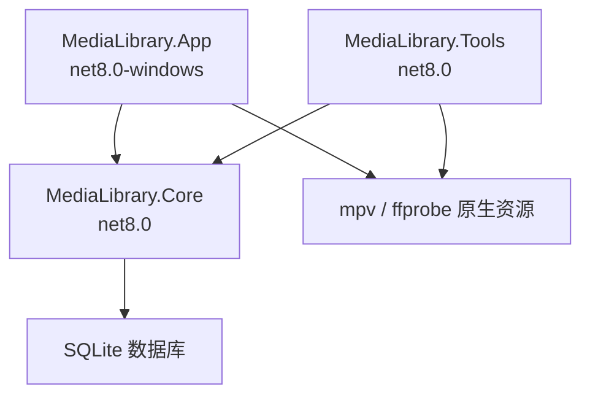

| 项目 | 职责 |
| --- | --- |
| `MediaLibrary.App` | WPF UI、ViewModel、导航、应用层服务、播放器窗口、主题和组合根。 |
| `MediaLibrary.Core` | 实体、EF Core、扫描、识别、外部服务、推荐、统计、缓存和业务服务。 |
| `MediaLibrary.Tools` | 内部命令行诊断和测试数据工具。当前 `package-test-data` 只能用于内部测试，不能进入正式包。 |

### 3.2 技术架构

- 开发语言：C#。
- 桌面框架：WPF。
- 运行时：.NET 8。
- 架构模式：MVVM 为主，部分复杂窗口交互使用 code-behind。
- 数据访问：EF Core 8 + SQLite。
- 依赖注入：`Microsoft.Extensions.DependencyInjection`。
- 播放器：自定义播放抽象 + libmpv 适配器。
- 媒体探测：外部 ffprobe 进程。
- 配置：数据库设置与 App 层 JSON 偏好并存。
- UI 样式：集中式 ResourceDictionary、自定义控件和行为。

### 3.3 分层与依赖方向

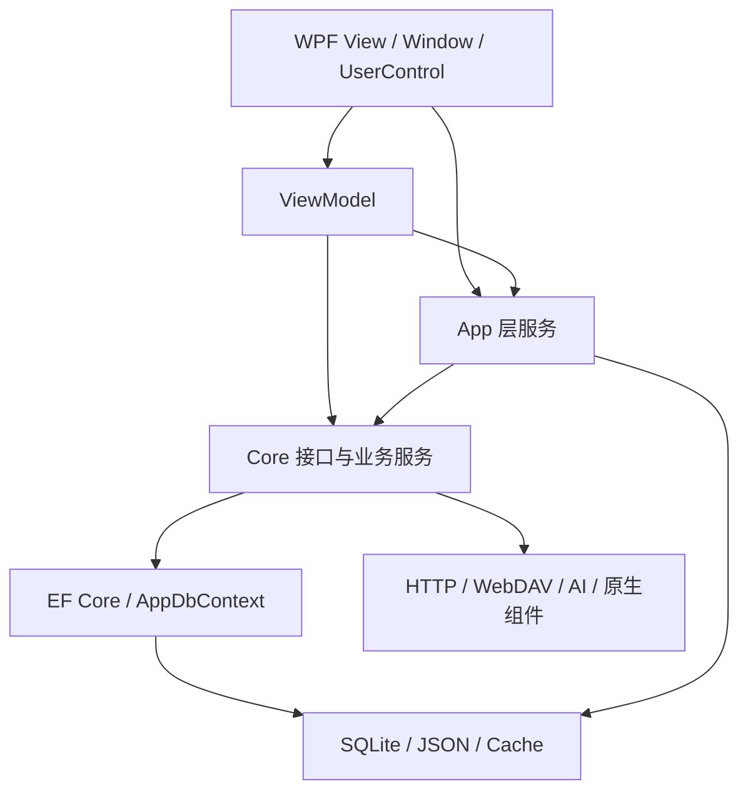

主要依赖规则：

- View 通过 DataContext、Command 和绑定消费 ViewModel。
- ViewModel 不直接操作 SQLite 表，主要依赖服务接口。
- App 层服务处理窗口、主题、导航、本地 JSON 和 WPF 特有能力。
- Core 服务创建短生命周期 `AppDbContext`，完成查询和写入。
- Core 不依赖 WPF。
- 播放核心通过 `IPlaybackEngine` 与 UI 隔离。

### 3.4 依赖注入与生命周期

`AppServiceProvider` 是桌面应用组合根。

- 大部分 Core 服务注册为 Singleton。
- 页面 ViewModel 注册为 Singleton，用于保留页面状态和减少重复实例。
- `PlayerWindowViewModel` 注册为 Transient，每次打开播放器创建独立播放会话状态。
- 主窗口 ViewModel 注册为 Singleton。
- 应用退出时释放根 `ServiceProvider`。

当前服务普遍不持有长期 `AppDbContext`，而是在方法内部通过 `AppDbContextOptionsFactory` 创建上下文，降低跨线程和长生命周期跟踪风险。

### 3.5 应用启动与退出

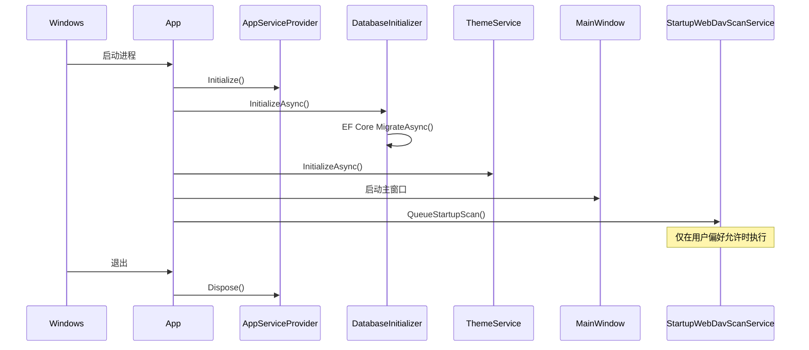

数据库迁移和主题初始化在主窗口正常使用前完成。初始化异常时显示启动失败并退出，避免应用在部分初始化状态下继续运行。

### 3.6 页面生命周期

所有页面 ViewModel 继承 `PageViewModelBase`，提供：

- `ActivateAsync`：页面激活后的异步加载。
- `Deactivate`：取消页面级操作或标记非活动状态。
- `IsRefreshing`：向壳层暴露刷新状态。

`MainWindowViewModel` 使用版本号和 `CancellationTokenSource` 防止旧页面异步结果覆盖新导航状态。部分列表页通过 `IDataRefreshService` 接收库、播放、收藏、推荐、扫描和 metadata 变更通知。

## 4. 模块设计

### 4.1 主窗口、导航与页面状态

职责：

- 承载自定义窗口框架、侧边栏、品牌区、页面标题和当前页面。
- 管理六个可见主导航和内部隐藏路由。
- 管理主题快捷切换、用户菜单和本地个人资料入口。
- 协调详情页背景和页面激活。

主要对象：

- `MainWindow`
- `MainWindowViewModel`
- `INavigationStateService`
- `NavigationStateService`
- `NavigationRequest`

可见主导航：

- 首页
- 媒体库
- 影片发现
- 观影历史
- 收藏夹
- 观影洞察

隐藏路由：

- Movie 详情
- Series 总览
- Season 详情
- Episode 详情
- 扫描任务
- AI 推荐兼容页
- 设置

导航服务保存有限的详情来源栈、部分 Tab 状态和滚动位置。它不是通用浏览器式路由系统，也不持久化到数据库。

### 4.2 首页

职责：

- 汇总片库数量和用户状态。
- 展示继续观看、最近新增和推荐预览。
- 提供媒体库、发现、历史、收藏和扫描快捷入口。

主要对象：

- `HomePage`
- `HomeViewModel`
- `IHomeDashboardQueryService`
- `HomeDashboardQueryService`

设计特点：

- 各模块允许独立失败，首页通过模块级刷新收集失败信息。
- 空库不生成虚假统计。
- Episode 继续观看进入 TV 详情或播放器链路。
- AI 推荐失败不阻断片库摘要和最近内容。

### 4.3 媒体库

职责：

- 统一展示 Movie、Series、Season、Unknown 和 Other。
- 提供搜索、筛选、排序、海报/列表布局和批量操作。
- 承载已移出媒体库项目的恢复和删除记录。

主要对象：

- `LibraryPage`
- `LibraryViewModel`
- `ILibraryQueryService`
- `LibraryQueryService`
- `VirtualizingWrapPanel`
- `LibraryPreferencesService`

设计特点：

- 查询结果投影为统一媒体库读模型，不要求不同实体共用数据库基类。
- 海报视图使用虚拟化面板，避免大库一次创建全部卡片。
- 刷新请求支持合并、节流和非活动页抑制。
- 布局偏好保存在 App 层 JSON，不增加数据库字段。
- 识别状态筛选不作为当前可见 UI，但后端识别状态继续保留。

批量操作遵循与单项操作相同的数据语义。取消操作不应构造虚假成功结果。

### 4.4 影片发现与推荐

职责：

- TMDB Movie/TV 搜索、人物搜索和分页。
- Movie/TV 热门、高分和趋势榜单。
- 外部条目状态投影与加入媒体库。
- Movie-only AI 推荐与自定义偏好。

主要对象：

- `MovieDiscoveryPage`
- `MovieDiscoveryViewModel`
- `RecommendationsViewModel`
- `ITmdbService`
- `IDiscoveryMovieStatusResolver`
- `IDiscoveryTvSeriesStatusResolver`
- `IRecommendationService`

影片发现使用三个 Tab：

1. 影片搜索。
2. 榜单。
3. AI 推荐。

Movie 和 TV 共用发现页，但使用独立结果模型和详情入口。TV 搜索与榜单不意味着 TV 进入 Movie 推荐、画像或洞察。

搜索和榜单请求使用取消令牌与请求版本控制，避免切换条件后旧结果覆盖新页面。推荐服务使用缓存、请求互斥、候选池和有界并发处理外部 metadata。

### 4.5 扫描来源与配置

职责：

- 管理 WebDAV 连接和扫描路径。
- 管理本地目录扫描路径。
- 测试连接、浏览路径、启用、停用和删除配置。
- 分别启动 WebDAV 和本地扫描。

主要对象：

- `ScanTasksPage`
- `ScanTasksViewModel`
- `ISettingsService`
- `IWebDavService`
- `IScanPathPickerService`
- `WebDavPathPickerWindow`

`SourceConnection` 表示来源连接，`ScanPath` 表示该连接下的扫描范围。本地来源也使用来源连接和扫描路径模型表达，从而复用扫描和媒体文件关系。

删除路径配置不会删除真实目录或远端内容。对该路径下软件来源记录的不可见处理使用 `MediaFile.IsDeleted`，仍不触碰物理文件。

### 4.6 扫描、识别与重新关联

职责：

- 枚举本地目录或 WebDAV 路径。
- 创建和更新 `MediaFile` 软件来源记录。
- 区分视频、字幕和其它文件。
- 运行 Movie/TV 识别、placeholder 分组和字幕绑定。
- 记录扫描结果、原因摘要和安全日志。
- 在来源重新出现时尝试重新关联。

主要对象：

- `MediaScanService`
- `LocalMediaScanService`
- `MovieIdentificationService`
- `TvSeasonIdentificationService`
- `TvScanDirectoryAnalysisService`
- `RescanReattachService`
- `SubtitleBindingService`
- `ScanProgressReporter`

扫描不以“绑定数量”作为唯一成功标准。扫描过程会分别统计扫描、新增、更新、忽略和错误，并将证据不足的媒体保留为 placeholder、NeedsReview 或候选状态。

扫描识别原则：

- 文件名和目录规则先提供本地证据。
- TV 目录分析识别 Season/Episode 结构。
- TMDB 用于候选搜索和 metadata。
- AI 仅提供分类或搜索 hint。
- 高风险写入需要规则门或用户确认。
- 不允许在生产代码中为具体片名、目录名或 TMDB ID 编写特例。

### 4.7 Movie 识别与人工修正

Movie 识别服务负责：

- 解析文件名中的标题和年份。
- 搜索 TMDB 候选。
- 创建或更新 Movie placeholder。
- 合并相同目标的来源。
- 应用手工确认结果。
- 在需要时异步补充列表 metadata 和主创信息。

人工修正使用“预览—确认—事务写入”的设计。单来源修正可以将来源重新归属为：

- Movie。
- TV Episode。
- Unknown Season。

Movie 修正不会移动或删除真实文件。涉及多实体关系调整时使用数据库事务，失败时回滚软件数据变更。

### 4.8 TV Series、Season 与 Episode

TV 数据模型保持三层结构：

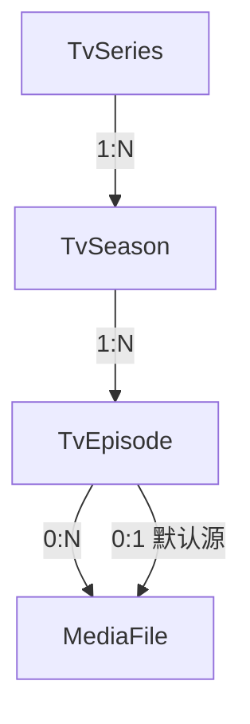

设计职责：

- `TvSeries` 保存整部剧的公共 metadata。
- `TvSeason` 保存季号、季 metadata 和识别状态。
- `TvEpisode` 保存集号、单集 metadata、观看状态和默认来源。
- `MediaFile` 作为 Episode 的实际播放源。

TV 识别优先保守处理：

- 目录和文件名能稳定解析时才自动绑定。
- 分辨率等数字不能误判为 Season/Episode。
- 跨季、SP、OVA、特典和复杂多集文件保留人工修正路径。
- metadata-only Episode 可以存在，但没有来源时不能播放。
- Grouped placeholder 可以进入未识别 Series/Season 详情继续修正。

### 4.9 详情页与统一修正壳层

详情页分为：

- `MovieDetailPage`
- `SeriesOverviewPage`
- `TvSeasonDetailPage`
- `EpisodeDetailPage`

共同设计：

- 使用详情路由和统一返回入口。
- 展示 metadata、状态和可用来源。
- 无来源时保留详情承载，不伪造播放能力。
- 播放源操作与 metadata 操作分区。
- 修正 UI 复用 `CorrectionDialogShell`，但各页面保留自己的候选和映射内容。

详情页不承担：

- 在线字幕搜索入口。
- 删除真实媒体。
- 新增 TV 洞察或 TV AI 推荐。

Movie、Season 和 Episode 修正 ViewModel 负责状态与命令，Core 修正服务负责最终数据一致性。

### 4.10 播放器

职责：

- 打开 Movie 或 Episode 播放会话。
- 选择默认或指定播放源。
- 驱动 libmpv。
- 管理播放、暂停、停止、跳转、全屏、音量和视频亮度。
- 管理播放源、音轨和字幕菜单。
- 保存观看进度并判断完成状态。
- Episode 播放时提供上一集和下一集。

主要对象：

- `PlayerWindow`
- `PlayerWindowViewModel`
- `IPlayerWindowService`
- `IPlaybackEngine`
- `MpvPlaybackEngineAdapter`
- `MpvPlayerSession`
- `PlaybackHostView`
- `IPlaybackSourceService`
- `IWatchHistoryService`

播放器采用独立窗口和瞬态 ViewModel。`PlayerWindowService` 保证同一时刻的活动播放器状态可追踪，并避免重复打开竞争。

播放抽象向 ViewModel 暴露：

- Opening
- Playing
- Paused
- Buffering
- PositionChanged
- DurationChanged
- EndReached
- EncounteredError
- TracksChanged
- SubtitleTrackChanged
- AudioTrackChanged

libmpv 会话在后台事件循环读取原生事件，再通过适配器转换为应用事件。播放器关闭时释放事件循环、原生句柄、缓存租约和偏好保存任务。

### 4.11 本地与 WebDAV 播放

本地来源直接使用本地文件路径。

WebDAV 来源根据播放会话使用远端 URI、HTTP Range 和 mpv 缓冲能力。设计要求：

- 服务器应支持 Range，才能获得更可靠的跳转和续播。
- 不在 UI 和日志中裸露完整远端 URL。
- 大文件恢复位置优先使用加载时起始参数。
- 来源失败不删除播放记录或来源绑定。
- HEVC 4K 和超大 WebDAV 文件仍需按 Known Issues 验证。

视频缓存后端仍存在，用于完整缓存命中、mpv 会话缓存目录和安全清理。当前正式 UI 不把它描述为完整离线缓存产品能力，也不提供视频缓存管理卡。

### 4.12 播放历史与完成判断

播放开始时创建或获得 `WatchHistory` 记录，播放过程中保存：

- 最后播放位置。
- 实际累计观看时长。
- 开始和结束时间。
- 是否完成。
- 对应 Movie 或 Episode。
- 实际 `MediaFile`。

`WatchCompletionEvaluator` 根据时长和位置判断是否达到完成规则。Movie 与 Episode 分别更新自己的已看状态。

异常退出时只能保证最后一次成功持久化的进度。跨来源续播使用保守兼容判断，不把明显时长不一致的来源强行共享进度。

### 4.13 字幕与音轨

字幕分为：

- mpv 内嵌字幕轨。
- 本地外挂字幕。
- OpenSubtitles 在线下载字幕。

本地字幕通过 `SubtitleBinding` 关联视频 `MediaFile` 和字幕 `MediaFile`。在线字幕通过 `OnlineSubtitleBinding` 关联 Movie、Episode 或当前 `MediaFile` 三种目标之一。

在线字幕流程：

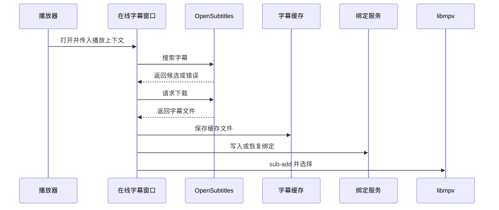

删除在线字幕绑定使用软删除，不等于立即物理删除缓存。缓存管理只清理没有活动绑定引用的孤立文件。

### 4.14 用户状态、收藏与媒体可见性

Movie 用户状态：

- 想看。
- 已看。
- 喜爱。
- 不想看。

TV 1.0 用户状态：

- Season 喜爱。
- Season 想看。
- Season 不想看。
- Season 已看投影。
- Episode 已看。

状态写入由 `UserCollectionService` 和 `TvSeasonCollectionService` 管理，并记录状态变更历史。

`LibraryVisibilityState` 与用户状态分离：

- `Auto`：由来源和状态推导是否显示。
- `Visible`：明确显示。
- `Hidden`：明确移出媒体库。

因此移出媒体库不会清除喜爱、想看、不想看或已看。

### 4.15 观影历史与收藏夹

观影历史以 `WatchHistory` 为事实来源，按日期分组展示 Movie 和 Episode。历史项是否可播放取决于实际来源是否仍有效。

收藏夹聚合两套集合模型：

- `UserMovieCollectionItem`
- `UserTvSeasonCollectionItem`

收藏页展示 Movie 与 Season，而不是把 TV 强行投影成 Movie。外部 metadata-only 收藏可以存在，但没有本地来源时不具备播放能力。

### 4.16 观影统计与画像

观影洞察包含：

- 画像分析。
- 观影统计。

主要对象：

- `WatchInsightsViewModel`
- `WatchStatisticsService`
- `WatchProfileInputService`
- `WatchProfileService`
- `WatchInsightCacheService`

1.0 洞察范围严格保持 Movie-only。

`WatchProfileInputService` 从 Movie 状态、历史和标签构建输入快照及 fingerprint。`WatchProfileService` 使用缓存和最多五路有界并行 AI 请求生成摘要、人格、DNA、象限和观看/喜爱对比。

数据不足、AI 未配置、缓存命中、缓存过期和生成失败均是正式状态，不应通过虚构内容填充。

### 4.17 设置、主题和本地偏好

数据库设置保存：

- TMDB。
- OMDb。
- OpenSubtitles。
- AI。
- 主题等核心应用设置。

App 层 JSON 保存：

- 关闭窗口行为。
- 打开播放器时是否全屏。
- 启动 WebDAV 自动扫描。
- 播放器音量、静音和亮度。
- 媒体库布局。
- 影片发现布局。
- 本地用户资料。

选择 JSON 的设置属于 UI 或桌面行为偏好，不需要为每个偏好新增数据库 migration。

主题支持：

- System。
- Light。
- Dark。

`ThemeService` 通过替换或更新应用级动态资源实现主题切换，并通知壳层更新图标和提示。

### 4.18 缓存管理

正式可见缓存类别：

- 海报缓存。
- TMDB/OMDb 等外部 metadata 缓存。
- 在线字幕缓存。

`SoftwareCacheManagementService` 并行读取各类缓存统计，再投影为设置页卡片。

安全原则：

- 海报和 metadata 可重新生成。
- 在线字幕只清孤立缓存。
- 引用扫描失败时禁用字幕清理。
- 缓存清理不删除媒体来源、用户状态或配置。
- 视频缓存后端不作为当前可见缓存管理类别。

### 4.19 用户资料

用户资料是本地 JSON 数据，不是账号系统。

支持保存：

- 用户名。
- 本地账号展示字段。
- 联系信息和简介字段。
- 本地头像路径。

头像文件由用户资料弹窗管理。无头像时使用首字母或默认图标。当前“退出登录”只是占位提示，不代表存在认证会话。

### 4.20 诊断与日志

诊断来源包括：

- 播放器、mpv 和视频缓存文件日志。
- 海报缓存和推荐调试日志。
- 扫描任务数据库记录。
- `Debug.WriteLine` 开发诊断。

日志设计要求：

- 使用错误类型、计数、阶段和耗时。
- 路径和 URL 应截断、哈希或不记录。
- 不记录账号、密码、Token 或 API Key。
- 用户提示与开发日志分离。

当前部分文件日志由 `DiagnosticLogPathResolver` 放在解决方案 `logs` 或应用基目录 `logs`，尚未完全统一到用户数据目录。

## 5. 数据设计

### 5.1 数据存储

主数据库为 SQLite，默认数据库文件位于当前用户 LocalAppData 下的兼容目录中。

EF Core 配置由以下部分组成：

- `AppDbContext`
- `AppDbContextOptionsFactory`
- 实体配置类
- `Data/Migrations`

服务方法按需创建 `AppDbContext`。应用启动时通过 `Database.MigrateAsync` 应用仓库内 migration。

### 5.2 核心实体关系

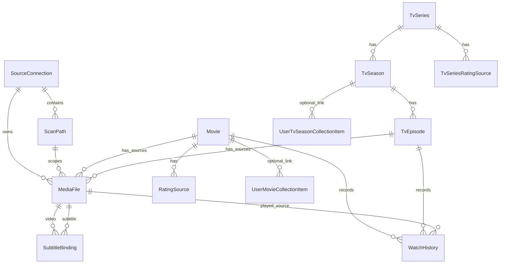

### 5.3 MediaFile 绑定约束

`MediaFile` 可以属于 Movie 或 Episode，但不能同时属于二者。数据库使用 Check Constraint 保证：

```text
MovieId IS NULL OR EpisodeId IS NULL
```

Movie 和 Episode 都可以拥有多个来源，并分别通过 `DefaultMediaFileId` 指向默认源。

`SourceConnectionId + FilePath` 有唯一索引，防止同一来源连接下重复创建相同软件来源记录。

### 5.4 WatchHistory 约束

每条观看历史必须且只能属于 Movie 或 Episode 之一：

```text
(MovieId IS NOT NULL AND EpisodeId IS NULL)
OR
(MovieId IS NULL AND EpisodeId IS NOT NULL)
```

历史删除关系使用 Restrict，避免删除媒体实体时静默破坏历史。删除记录服务必须显式处理相关软件数据。

### 5.5 字幕绑定约束

本地字幕绑定对视频来源和字幕来源建立唯一组合。

在线字幕绑定目标必须三选一：

- Movie。
- Episode。
- MediaFile。

绑定使用软删除和唯一索引组合，支持恢复已有绑定并避免活动重复项。

### 5.6 集合与外部条目

集合表可以同时承载：

- 已链接本地实体的项目。
- 仅有 TMDB metadata 的外部项目。

因此 `MovieId`、`TvSeasonId` 等本地外键允许为空，而 TMDB ID、标题、海报和状态仍可保存。

该设计支持“先想看、后入库”，同时要求播放能力始终由真实 `MediaFile` 决定。

### 5.7 缓存实体

`ExternalMetadataCache` 使用：

- Provider。
- CacheType。
- CacheKey。
- JSON Payload。
- 到期时间。
- 命中时间和次数。

Provider、类型和 Key 组成唯一索引。Watch Insights 使用独立 `WatchInsightCacheEntry`，按 Kind 和 ScopeKey 唯一，并记录 fingerprint、过期、陈旧和最后错误。

### 5.8 数据生命周期

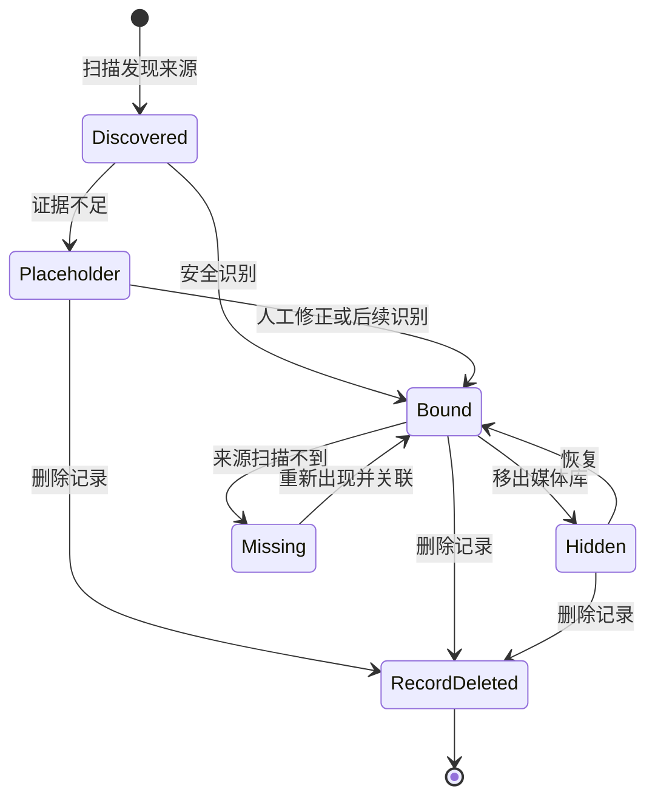

说明：

- `Missing` 通过 `MediaFile.IsDeleted` 表达软件来源不可用。
- `Hidden` 通过集合可见性表达，不等同于来源消失。
- `RecordDeleted` 只影响软件数据。
- 真实文件生命周期不由该状态机管理。

### 5.9 事务与一致性

需要跨多个实体移动来源或改变绑定的操作使用 EF Core 事务，例如：

- Movie 手工匹配。
- TV Season/Episode 映射。
- Unknown Season 修正。
- 来源拆分和跨类型修正。

普通独立查询和简单状态更新使用短生命周期上下文和单次 `SaveChangesAsync`。

一致性保护包括：

- 数据库 Check Constraint。
- 唯一索引。
- 外键删除行为。
- 服务层目标类型检查。
- `MediaFile.IsDeleted` 和媒体类型检查。
- 用户确认。
- 事务提交或回滚。

### 5.10 Migration 策略

- Migration 文件随代码版本提交。
- 应用启动时自动调用 `MigrateAsync`。
- 正式安装器不直接执行独立 database update。
- 升级前应提供备份说明。
- 新增 schema 变更必须单独授权和验证。
- Phase 8.2 不新增 migration。

### 5.11 应用数据目录

默认用户数据根目录为当前用户 LocalAppData 下的兼容目录 `MediaLibrary`。

主要内容：

```text
MediaLibrary/
  media-library.db
  VideoCache/
  PosterCache/
  OnlineSubtitles/
  user-profile.json
  app-behavior-preferences.json
  player-preferences.json
  library-preferences.json
  discovery-preferences.json
```

`XFVERSE_APPDATA_DIR` 可覆盖数据根目录，但只用于高级诊断、测试和受控环境。

## 6. 关键流程设计

### 6.1 本地目录扫描

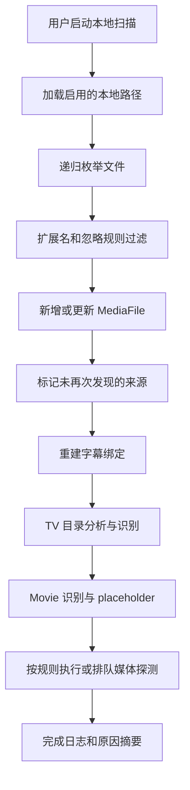

取消令牌在枚举和处理阶段传播。取消后任务记录为取消或部分结果，不把未完成任务写成成功。

### 6.2 WebDAV 扫描

WebDAV 扫描与本地扫描共享后半段识别流程，但文件枚举来自 WebDAV 客户端。

关键差异：

- 需要连接配置和认证。
- 路径使用规范化远端路径。
- 远端错误信息必须脱敏。
- 文件来源保存远端 URI，但 UI 不裸露完整 URL。
- 网络中断不应清空已有 metadata。

### 6.3 安全识别流程

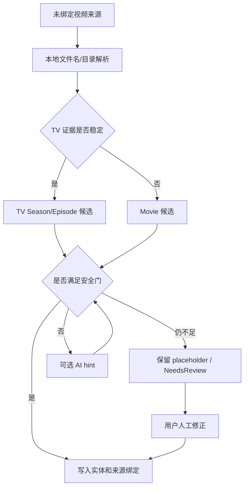

AI 结果不能直接改变“证据不足”的事实。AI 无法提供可验证目标时，系统保留待修正状态。

### 6.4 人工修正流程

1. 详情页打开修正 Dialog。
2. ViewModel 加载当前对象和安全来源摘要。
3. 用户选择目标类型并搜索候选。
4. 服务生成预览或映射行。
5. 用户确认最终目标。
6. Core 服务验证来源仍有效。
7. 在事务中调整实体和来源关系。
8. 更新默认来源、可见性和相关 metadata。
9. 提交事务。
10. 通知页面和媒体库刷新。

任何一步失败都不得删除真实文件。

### 6.5 播放流程

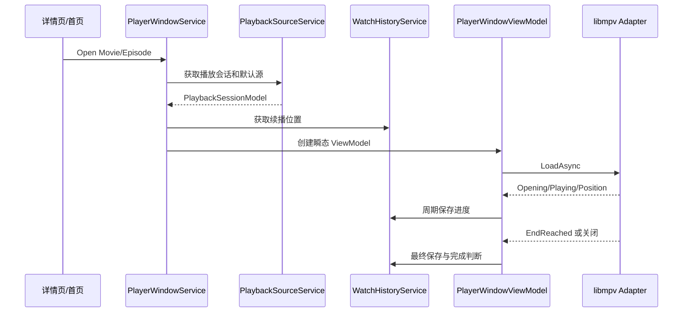

播放源切换重新加载当前选定来源，但保留实体上下文。来源切换失败不删除默认来源或其它来源。

### 6.6 影片发现加入媒体库

- 发现结果先经过状态解析器读取本地实体和集合状态。
- 用户加入 Movie 时可以创建或更新集合 metadata。
- 用户加入 TV 时创建或更新 Series/Season metadata 和状态。
- 没有真实来源时只形成 metadata-only 条目。
- 系统不为外部条目创建虚假 `MediaFile`。
- 后续扫描发现真实来源后可通过识别服务建立关联。

### 6.7 状态与洞察刷新

用户修改已看、喜爱、想看或不想看后：

1. 集合服务写入当前状态。
2. 状态历史记录器保存变更。
3. `IDataRefreshService` 发出数据变化通知。
4. 活动页面按需要刷新。
5. Watch Insights 缓存根据 fingerprint 或 stale 标志刷新。
6. Recommendation 使用新的 Movie-only 输入。

TV 状态变化可以刷新收藏和 TV 页面，但不会进入 Movie 洞察输入。

### 6.8 缓存清理

缓存清理先读取使用量和引用状态，再执行目标类别清理。

- 海报缓存：删除可再生成图片。
- metadata 缓存：删除托管的外部响应记录。
- 在线字幕缓存：只删除孤立文件。
- 活动或被引用文件：跳过。
- 清理后重新计算统计并反馈释放容量。

## 7. 外部服务设计

### 7.1 WebDAV

WebDAV 服务负责：

- 连接测试。
- 目录枚举。
- 扫描文件 metadata。
- Range 下载或流式读取。
- 为播放器和 ffprobe 提供远端访问。

连接配置存储在本地数据库。当前密码保护仅为 Base64 编码，是 Phase 8.3 的正式版安全收口项。

### 7.2 TMDB

TMDB 用于：

- Movie/TV 搜索。
- 人物及作品搜索。
- 热门、高分和趋势榜单。
- Movie、Series、Season、Episode metadata。
- 海报、主创和外部 ID。

服务使用持久缓存和节流。详情补充采用有界并发，单个候选失败时保留搜索级数据，不阻断整个列表。

### 7.3 OMDb

OMDb 只补充外部评分和部分外部 ID 信息。

OMDb 不可用时：

- 不阻止详情页打开。
- 不阻止播放。
- 不删除已存在的其它评分。
- UI 只隐藏或标记对应评分不可用。

### 7.4 OpenSubtitles

OpenSubtitles 客户端负责：

- 配置探测。
- 搜索。
- 下载额度合同检查。
- 字幕下载。

下载结果必须经过本地缓存保存和绑定服务，不能把临时响应直接视为永久可用字幕。

### 7.5 AI 服务

AI 服务使用 OpenAI-compatible Base URL、API Key 和模型配置。

用途：

- Movie 标签分类。
- 修正搜索建议。
- Movie 推荐。
- Movie 观影画像。

设计限制：

- AI 不是应用启动依赖。
- AI 不是最终识别事实来源。
- 请求支持取消、超时和错误映射。
- 推荐和画像使用缓存与 fingerprint。
- TV 不进入 1.0 Movie 推荐和画像。

## 8. 安全与隐私设计

### 8.1 本地优先

XFVerse 的数据库、偏好、用户资料和缓存默认保存在当前 Windows 用户目录。

本地优先不等于所有功能完全离线：

- 本地扫描和本地播放可以离线使用。
- WebDAV、发现、在线 metadata、在线字幕和 AI 需要网络。
- 用户必须自行配置第三方服务。

### 8.2 凭据保护现状

`SecretProtector` 当前使用 Base64 编码实现 `Protect` 和 `Unprotect`。

该实现：

- 避免直接以原始明文字符串保存。
- 不提供真正的加密安全。
- 可被轻易还原。
- 不得在文档中称为安全加密。

Phase 8.3 需要设计兼容旧值的 Windows 用户级保护方案。若方案需要 schema 变化，必须先获得 migration 授权。

### 8.3 日志脱敏

日志允许记录：

- 实体 ID。
- 数量。
- 阶段名。
- 耗时。
- 错误类型。
- 哈希或截断标识。
- 不含敏感数据的文件名样本。

日志禁止记录：

- 完整本地路径。
- 完整 WebDAV URL。
- 用户名和密码。
- Token 和 API Key。
- 私有媒体清单。
- 可直接恢复的认证头。

### 8.4 正式包隐私

正式包必须从空 staging 构建。

禁止进入正式包：

- 用户数据库。
- AppData 配置。
- 用户资料和头像。
- 日志。
- 缓存。
- 播放历史。
- 推荐和画像缓存。
- 真实媒体名和路径。
- 任何凭据。

`MediaLibrary.Tools package-test-data` 及测试安装器的 seed-data 链路只能用于内部测试。

### 8.5 数据操作安全

高风险操作使用确认和明确文案：

- 移出媒体库使用警示语义。
- 删除记录使用危险语义。
- 删除扫描路径说明不会删除真实目录。
- 清理缓存说明只清软件缓存。
- 删除字幕绑定说明缓存可能保留。

服务层语义不能仅依赖 UI 文案保护，Core 写入仍需限制操作范围。

### 8.6 安装数据策略

- 首次安装只安装程序文件。
- 覆盖升级保留用户数据。
- 修复安装不重置数据库和配置。
- 默认卸载保留用户数据。
- 完整清理由用户退出应用后手工执行。
- 安装器不删除本地媒体和 WebDAV 内容。

## 9. 性能与可靠性设计

### 9.1 异步与取消

耗时操作普遍使用 `Task` 和 `CancellationToken`：

- 页面加载。
- 发现搜索和榜单。
- 扫描。
- 识别。
- AI 请求。
- 在线字幕搜索。
- 播放器加载和关闭。

页面导航通过取消旧激活任务和版本检查避免过期结果写入 UI。

### 9.2 有界并发

有界并发用于：

- Movie 列表 metadata 补充。
- 推荐候选 TMDB 解析。
- OMDb 评分补充。
- Watch Profile 多卡片生成。
- TV 候选详情补充。

设计目标是减少等待，但不对第三方 API 发起无界请求。

### 9.3 列表与海报

媒体库海报布局使用 `VirtualizingWrapPanel`，只实现视口附近容器。

海报处理包含：

- 本地海报缓存。
- 远端海报按需下载。
- 缩略图解码宽度。
- 占位海报。
- 有界阴影缓存。

复杂详情背景使用静态缓存和海报衍生色，不使用实时全屏背景模糊。

### 9.4 外部 metadata 缓存

TMDB/OMDb 等响应使用 SQLite 持久缓存，减少重复请求并提供网络失败时的有限回退。

缓存条目记录：

- Provider。
- 类型。
- Key。
- Payload。
- 过期时间。
- 命中统计。

### 9.5 播放可靠性

播放器可靠性措施：

- 原生架构检查。
- 独立 mpv 会话 ID。
- 丢弃旧会话事件。
- 关闭时取消事件循环。
- WebDAV 加载时续播位置。
- 缓冲和操作提示分离。
- 活动缓存租约保护。
- 进度定期持久化。

已知风险：

- 超大 WebDAV 长时间播放可能卡顿。
- HEVC 4K 依赖硬件解码策略和设备能力。
- 音量 101%～200% 可能削波。
- 视频亮度不是显示器背光控制。

### 9.6 扫描可靠性

- 扫描支持取消。
- 每个路径记录独立日志。
- 文件消失使用软件标记。
- 文件重新出现可以重新关联。
- 识别失败保留 placeholder。
- 任务原因摘要使用稳定原因键和计数。
- 日志不反向成为业务规则。

## 10. 错误处理与可诊断性

### 10.1 UI 状态模型

页面和组件需要覆盖：

- loading。
- empty。
- error。
- disabled。
- config missing。
- auth failed。
- rate limited。
- data insufficient。
- no source。
- metadata-only。
- cancelled。
- partial failure。

状态必须反映真实服务能力，不显示假进度、假识别数量或假暂停功能。

### 10.2 用户提示与开发诊断

用户提示应：

- 使用中文。
- 描述用户可采取的下一步。
- 避免暴露异常堆栈和敏感值。
- 区分配置缺失、网络失败和数据不足。

开发诊断应：

- 记录错误类型和阶段。
- 提供足够的关联 ID。
- 避免把完整原始异常文本长期保存到数据库。

### 10.3 数据一致性错误

当目标实体、来源或绑定状态在操作期间发生变化：

- 重新读取数据库状态。
- 拒绝使用过期目标。
- 不创建虚假替代记录。
- 事务写入失败时回滚。
- UI 刷新当前事实。

## 11. 部署、升级与兼容性

### 11.1 正式发布模型

- Windows 10/11 x64。
- .NET 8 self-contained。
- 当前用户安装。
- 单架构安装器。
- 不要求管理员权限。
- 不提供 1.0 Portable 包。

ARM64 测试发布路径不属于 1.0 GA。

### 11.2 原生资源

应用发布目录需要包含：

- x64 `libmpv-2.dll` 及运行依赖。
- ffprobe 和必要 ffmpeg 运行文件。
- WPF 资源。
- 海报占位图、图标和 WatchPersona 资产。

`NativeRuntimeResolver` 和 mpv 加载器检查当前进程架构和 PE Machine 类型。架构不匹配时播放功能给出明确错误。

### 11.3 版本

正式版本为 `1.0.0`。

Phase 8.3 必须建立单一版本源，并同步：

- 程序集版本。
- 文件版本。
- 信息版本。
- 设置页。
- 安装器。
- 发布说明。

### 11.4 正式与测试链路隔离

正式安装器必须：

- 使用新的稳定 AppId。
- 使用独立正式脚本。
- 使用空 staging。
- 使用独立输出目录。
- 使用明确 RC/GA 文件名。
- 不继承测试包的数据删除规则。

### 11.5 回滚原则

1.0 没有自动更新器。升级通过新版安装器完成。

如果升级失败：

- 优先保留用户数据库副本。
- 不通过删除 AppData 解决普通程序文件问题。
- 修复安装只处理程序文件。
- 数据恢复按帮助文档执行。

## 12. UI / UX 设计

### 12.1 既有设计流程

XFVerse 当前 UI 的形成过程为：

1. 在 `DesignDraft/screenshots` 绘制主要页面草图和区域关系。
2. 在 `DesignDraft/page-spec` 编写页面规格。
3. 使用 `DESIGN.md`、资源说明和全局规则冻结视觉方向与语义。
4. 按阶段把草图和规格转换为 WPF XAML、ResourceDictionary、自定义控件和 ViewModel 状态。
5. 运行应用，对照草图检查布局、滚动、窗口、弹窗、主题和长文本。
6. 草图与业务、安全或实际数据能力冲突时，以业务和安全为先。
7. 通过 Phase 7 多轮页面实施和回归收口当前 UI。

该流程是对已经完成工作的记录。Phase 8.2 不重新绘制草图，也不修改实际 UI。

### 12.2 草图的作用

草图主要用于：

- 确认页面区域和信息层级。
- 确认展开/收起侧栏关系。
- 确认卡片、列表、Tab 和滚动区域。
- 确认详情页和播放器的大体布局。

草图中的颜色、黑色占位块、临时字段和旧按钮不直接代表最终实现。页面规格和实际代码拥有更高优先级。

### 12.3 UI 信息架构

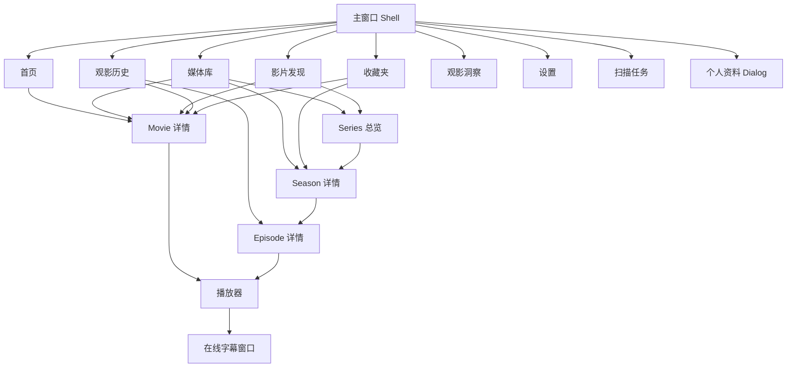

### 12.4 设计系统实现

当前 UI 使用原生 WPF 和集中式资源系统。

主要资源字典：

- `Colors.Light.xaml`
- `Colors.Dark.xaml`
- `Tokens.xaml`
- `Theme.xaml`
- `Controls.xaml`
- `Cards.xaml`
- `Buttons.xaml`
- `Inputs.xaml`
- `Navigation.xaml`
- `PageTabs.xaml`
- `Glass.xaml`
- `Badges.xaml`
- `Menus.xaml`
- `Dialogs.xaml`
- `Status.xaml`
- `Progress.xaml`
- `Player.Dark.xaml`
- `Player.Controls.xaml`

`DesignDraft` 曾把 WPF UI 作为基础控件库目标，但当前项目文件没有 WPF UI 包依赖。实际落地采用原生 WPF、自定义 ControlTemplate、ResourceDictionary 和自定义控件。这属于技术实现调整，不影响已确认的信息架构和视觉方向。

### 12.5 视觉语言

产品视觉方向：

- 现代 Windows 桌面软件。
- 灰粉和中性色为主。
- 低饱和语义色。
- 克制的液态玻璃观感。
- 清晰的信息层级。
- 浅色和深色双主题。

玻璃效果使用静态半透明表面、边缘高光、缓存阴影和海报衍生背景，不使用高成本实时背景模糊。

播放器固定使用深色沉浸式视觉，不随主应用浅色主题变为浅色。

### 12.6 Token 与组件

`Tokens.xaml` 集中定义：

- 字体。
- 字号和行高。
- 圆角。
- 页面和卡片间距。
- 按钮和输入尺寸。
- 侧栏宽度。
- 海报卡片尺寸。
- 阴影。

主要自定义组件：

- `PhosphorIcon`
- `CachedShadowBorder`
- `VirtualizingWrapPanel`
- `CorrectionDialogShell`
- `SensitiveSettingInput`
- `SettingFieldRow`
- `ApiConfigCard`
- `CacheCategoryCard`
- `ScanPathCard`
- `ScanLogCard`
- `SmartDatePicker`
- `RatingStarsBar`
- 洞察图表控件

组件优先复用公共资源，不为每个页面重新硬编码一套颜色和状态。

### 12.7 页面设计摘要

| 页面 | 页面目标 | 主要结构 | 关键状态 |
| --- | --- | --- | --- |
| Shell | 全局导航与品牌承载 | 自定义标题栏、侧栏、账号区、内容区 | 展开/收起、主题、详情路由 |
| 首页 | 快速了解片库并继续观看 | 统计、继续观看、最近新增、推荐预览 | 空库、模块失败、无来源 |
| 媒体库 | 浏览和管理全部媒体 | 工具栏、筛选、摘要、海报/列表、批量栏 | loading、empty、批量、已移出 |
| 影片发现 | 搜索、榜单和推荐 | 三个 Tab、筛选、分页、卡片/列表 | 未配置、网络失败、无结果 |
| Movie 详情 | Movie metadata 和来源管理 | Hero、评分、简介、标签、来源、修正 | 无来源、metadata-only、修正中 |
| Series 总览 | 展示整剧与 Season | Hero、metadata、状态、Season 列表 | metadata-only、无 Season |
| Season 详情 | 展示 Episode 与季状态 | Hero、季操作、Episode 列表、修正 | 未识别季、无来源集 |
| Episode 详情 | 单集资料和多来源 | 单集 Hero、状态、来源、修正 | 无来源、探测失败 |
| 播放器 | 沉浸播放和轨道管理 | 视频宿主、顶部信息、底部控制、Popup | opening、buffering、error、notice |
| 在线字幕 | 搜索、下载和绑定 | 搜索条件、上下文、结果列表 | 未配置、额度、无结果、下载失败 |
| 观影历史 | 按日期查看播放记录 | 日期筛选、分组海报列表 | empty、失效来源、目标日期 |
| 收藏夹 | 查看喜爱和想看 | 两个 Tab、Movie/Season 卡片 | empty、移除中、不可移除 |
| 观影洞察 | Movie 统计和画像 | 画像/统计 Tab、卡片、图表、日历 | 数据不足、AI 缺失、缓存回退 |
| 扫描任务 | 管理来源和任务 | WebDAV、本地目录、进度、日志 | 运行、取消、部分失败 |
| 设置 | 配置行为、API 和缓存 | 通用/API Tab、设置行、缓存卡 | 未测试、测试成功/失败、清理中 |
| 个人资料 | 编辑本地资料 | 头像、字段、保存/取消 | 默认头像、字段校验、保存失败 |

### 12.8 交互原则

- 主操作与危险操作视觉分离。
- 无真实能力的按钮不显示或禁用并说明原因。
- 提交式搜索避免每次按键触发昂贵查询。
- 详情页播放按钮只在有可用来源时启用。
- 长路径和 release name 使用省略与 Tooltip。
- 完整 WebDAV URL 不通过 Tooltip 暴露。
- 弹窗默认焦点优先安全操作。
- 页面内部列表根据实际内容决定独立滚动区域。
- 详情返回优先返回来源页面，无法恢复时使用层级 fallback。

### 12.9 草图—规格—实际 UI 追溯

| 页面/组件 | 草图证据 | 页面规格 | 实际 View / 组件 | 落地状态 | 主要差异与原因 |
| --- | --- | --- | --- | --- | --- |
| 全局 Shell | 首页、媒体库等展开/收起图 | `global-shell.md` | `MainWindow.xaml` | 调整后落地 | 使用自定义窗口框架和真实隐藏路由；黑色草图占位替换为 Phosphor 图标和实际资源。 |
| 首页 | `screenshots/首页/*` | `home-page.md` | `HomePage.xaml` | 调整后落地 | 统计口径改为当前真实状态；推荐失败可独立降级。 |
| 媒体库 | `screenshots/媒体库/*` | `media-library-page.md` | `LibraryPage.xaml` | 调整后落地 | 移除可见识别状态筛选；加入 Movie/TV/Other、已移出面板和真实虚拟化。 |
| 影片发现 | `screenshots/影片发现/*` | `movie-discovery-page.md`、`recommendation-page.md` | `MovieDiscoveryPage.xaml` | 调整后落地 | Movie/TV 共页；AI 推荐嵌入第三 Tab；隐藏兼容路由保留。 |
| Movie 详情 | `screenshots/影片详情页/*` | `movie-detail-page.md`、`correction-flow.md` | `MovieDetailPage.xaml` | 调整后落地 | 采用海报背景和玻璃卡；修正内容使用共享 Dialog 壳层；字幕入口归播放器。 |
| Series/Season | 无完整旧草图，沿用详情基线 | `tv-detail-page.md` | `SeriesOverviewPage.xaml`、`TvSeasonDetailPage.xaml` | 规格后落地 | 复用 Movie 详情语言并保持 Series/Season 层级。 |
| Episode | 无完整旧草图 | `episode-detail-page.md` | `EpisodeDetailPage.xaml` | 规格后落地 | 增加 Episode 来源、默认源、探测和跨类型修正。 |
| 统一修正 | Movie 修正草图 | `correction-flow.md` | `CorrectionDialogShell` 及内容控件 | 调整后落地 | 共享窗口壳层，页面保留自己的业务内容和命令。 |
| 播放器 | `screenshots/播放器/*` | `player-page.md` | `PlayerWindow.xaml` | 调整后落地 | 使用 libmpv/HwndHost；Overlay 通过 Popup 显示在原生视频表面之上。 |
| 在线字幕 | 无独立草图 | `online-subtitle-search-page.md` | `OnlineSubtitleSearchWindow.xaml` | 规格后落地 | 固定深色窗口；搜索、下载、绑定与错误状态来自真实服务。 |
| 观影历史 | `screenshots/观影历史/*` | `watch-history-page.md` | `WatchHistoryPage.xaml` | 调整后落地 | 使用日期分组和 SmartDatePicker，支持 Movie/Episode。 |
| 收藏夹 | `screenshots/收藏夹/*` | `favorites-page.md` | `FavoritesPage.xaml` | 调整后落地 | 使用喜爱/想看 Tab，展示 Movie/Season。 |
| 观影洞察 | `screenshots/观影洞察/*` | `watch-insights-page.md` | `WatchInsightsPage.xaml` | 调整后落地 | 画像模块扩展为真实 AI/缓存状态；统计保持 Movie-only。 |
| 扫描任务 | `screenshots/账号/扫描任务/*` | `scan-task-page.md` | `ScanTasksPage.xaml` | 调整后落地 | WebDAV/本地分区；只提供真实取消，不提供假暂停和假识别计数。 |
| 设置 | `screenshots/账号/设置/*` | `settings-page.md`、`cache-management-page.md` | `SettingsPage.xaml` | 调整后落地 | 主题改为设置行内分段选择；可见缓存只保留三类；敏感字段默认隐藏。 |
| 个人资料 | `screenshots/账号/个人资料/*` | `user-profile-dialog.md` | `UserProfileDialogWindow.xaml` | 调整后落地 | 使用本地资料，不接登录和云同步。 |
| 确认弹窗 | 页面草图中的确认需求 | `global-dialogs.md` | `ConfirmationDialogWindow.xaml` | 已落地 | 普通、警示和危险语义复用同一窗口。 |

### 12.10 已确认的设计调整

- WPF UI 库目标调整为原生 WPF 集中资源实现。
- 设置页旧草图的独立右上角主题按钮改为通用设置内主题分段选择。
- 媒体库不显示识别状态筛选。
- 扫描页不显示服务未提供的暂停和稳定识别计数。
- 详情页不提供字幕入口。
- AI 推荐作为影片发现 Tab，不作为主导航。
- 视频缓存后端保留，但不作为正式可见缓存管理产品能力。
- “账号”视觉入口实际承载本地资料，不代表登录系统。

### 12.11 可访问性与适配

当前设计关注：

- 100%、125%、150% Windows 缩放。
- 侧栏展开与收起。
- 窗口最大化、还原和全屏。
- 浅色/深色对比。
- 键盘焦点和按钮可执行状态。
- 长文本换行、省略和 Tooltip。
- 状态不能只依赖颜色。
- 播放器菜单固定深色可读性。

正式 RC 仍需验证多显示器、DPI、最小窗口和高对比场景。

## 13. 测试与验收设计

当前解决方案没有默认自动化 test 项目。

验证层次：

1. `dotnet build MediaLibrary.sln`。
2. 静态代码和配置审计。
3. Migration diff 检查。
4. 目标页面人工验收。
5. 本地/WebDAV 扫描验证。
6. 播放器和字幕专项验证。
7. 安装、升级、修复和卸载验证。
8. 敏感信息和第三方声明检查。
9. 文档与 RC 行为一致性检查。

正式 RC 按 `XFVERSE_1_0_RC_ENVIRONMENT_MATRIX.md` 执行，不以 build 通过替代运行验收。

## 14. 关键设计决策

| 决策 | 结果 |
| --- | --- |
| 桌面技术 | .NET 8 + C# + WPF。 |
| 应用形态 | 独立 Windows 桌面应用。 |
| 数据库 | SQLite + EF Core migrations。 |
| UI 架构 | MVVM 为主，复杂原生窗口交互允许 code-behind。 |
| 服务组合 | 内置 DI 容器和应用组合根。 |
| 播放核心 | libmpv，不使用旧 LibVLC 正式路径。 |
| 媒体探测 | ffprobe。 |
| 识别策略 | 准确性、可解释性和可回滚性优先。 |
| AI | 只作 hint、推荐和画像，不作最终事实。 |
| Movie/TV | 共享媒体库和发现入口，保持实体和洞察边界。 |
| 删除语义 | 软件记录与真实文件严格分离。 |
| UI 形成 | 先草图和页面规格，后 WPF 实现和运行收口。 |
| 正式平台 | Windows 10/11 x64 self-contained。 |
| 更新 | 1.0 手动下载安装器升级。 |

## 15. 1.0 限制与非目标

- ARM64 和 X86 不属于正式支持。
- 没有自动更新器。
- 没有 Portable 包。
- 没有云账号和跨设备同步。
- “退出登录”未接入。
- TV 不进入 Watch Insights、Movie AI 推荐、画像或 fingerprint。
- 不支持自动删除真实媒体。
- 复杂 TV 特典和跨季文件仍可能需要人工修正。
- 超大 WebDAV 长时间播放可能受网络和缓存行为影响。
- 凭据保护仍待 Phase 8.3 收口。
- 正式安装器、第三方声明和包体积仍待后续阶段完成。

## 16. 引用文档

- `PHASE_8_PLAN.md`
- `XFVERSE_1_0_FEATURE_MATRIX.md`
- `XFVERSE_1_0_RELEASE_DECISIONS.md`
- `XFVERSE_1_0_DOCUMENTATION_ARCHITECTURE.md`
- `XFVERSE_1_0_RC_ENVIRONMENT_MATRIX.md`
- `DesignDraft/DESIGN.md`
- `DesignDraft/codex-ui-rules.md`
- `DesignDraft/resources-note.md`
- `DesignDraft/page-spec/*`
- `DesignDraft/PHASE_6_COVERAGE_MATRIX.md`
- `DesignDraft/PHASE_7_PLAN.md`
- `DesignDraft/PHASE_7_STAGE_LOG.md`
- 各业务主题下的计划、阶段日志和 Known Issues。
